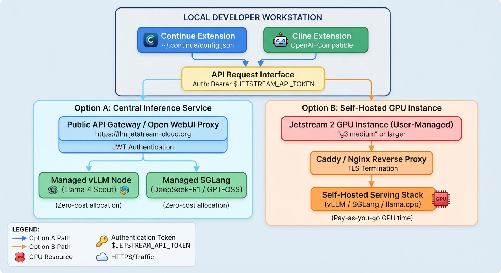

# Running & Integrating LLMs on Jetstream 2

## For the impatient

!!! note Instant LLM chat
    For most users the zero‑cost central service at 
    
    * <https://llm.jetstream-cloud.org> 
    
    is the fastest way to start querying Llama 4 Scout, DeepSeek‑R1, or GPT‑OSS‑120B.



!!! warning
    The document contains secrets such as tokens. They should never be hard‑coded.  All token usage must reference the 
    
    * **$JETSTREAM_API_TOKEN** 
    
    environment variable (see the *Safely storing the token locally* section).  If the document is not clear on that studenst are responsible to update it so others can benefit from it.

## Overview

Jetstream 2 gives you **two distinct ways** to run Large Language Models (LLMs). Both expose an **OpenAI‑compatible HTTP API**, but they differ in how the request is routed:

| Routing path | What it is | Authentication |
|--------------|------------|----------------|
| **Through the Open WebUI proxy** | Public gateway that forwards the call to Jetstream’s managed inference service. | Requires a JWT **API token** (generated in the Open WebUI). |
| **Direct backend (vLLM / SGLang)** | Calls the native backend containers directly. | No token required (you may supply any non‑empty string if your client insists on an `apiKey`). |

!!! note In short
    The proxy route uses the public API gateway and needs your token; the direct route hits the native vLLM/SGLang server without authentication.

To help you decide, the table below compares the two deployment models.

| Feature | **Option A – Central Inference Service** | **Option B – Self‑Hosted GPU Instance** |
|---|---|---|
| **Cost** | Zero‑cost allocation (only your compute quota) | Pay‑as‑you‑go GPU time |
| **Setup time** | < 5 min (no VM provisioning) | Hours (GPU instance, OS, serving stack) |
| **Model catalogue** | Pre‑deployed, high‑end open models (Llama 4 Scout, DeepSeek‑R1, GPT‑OSS‑120B) | Any model you upload (GGUF, full‑precision, LoRA, …) |
| **Flexibility** | Fixed backend versions, managed scaling | Full control over environment, custom training, fine‑tuning |
| **Network access** | Public API (token‑auth) *or* internal‑only direct endpoints | Public only if you expose via TLS/SG; otherwise internal only |
| **Typical use‑case** | Quick prototyping, API‑first apps | Custom weights, experimental quantisation, training pipelines |

!!! warning
    Do **not** use Option B unless you are prepared for GPU charges.  

---

## Prerequisites

### Option A – Central Inference Service

1. An active Jetstream 2 account.  

2. **API token (JWT)** generated from the Open WebUI – see the “Obtaining an Open WebUI API Token” section below.  

3. Ability to make outbound HTTPS requests from your workstation (no firewall blocks).

### Option B – Self‑Hosted GPU Instance

1. GPU quota (e.g. a `g3.medium` node or larger) and a project that permits GPU allocations.  

2. Familiarity with SSH, `git`, and a Linux shell.  

3. (Optional but recommended) a domain name or Jetstream sub‑domain and a TLS terminator (Caddy, Nginx, Traefik).

---

## Obtaining an Open WebUI API Token (Option A)

Jetstream 2’s central inference service protects the public gateway with a **JWT API token** that you generate in the Open WebUI. The steps below are current as of August 2026; if the UI changes, look for a **“API keys”** section under your user profile.

### 1. Log in to the Open WebUI

1. Open a browser and go to <https://llm.jetstream-cloud.org>.  

2. Sign in with your Jetstream 2 credentials (institutional login or Jetstream password).

### 2. Navigate to the token‑creation page  

| UI element | Action |
|------------|--------|
| **User‑profile icon** (lower‑left corner) | Click it. |
| **Settings** | Choose it from the pop‑up menu. |
| **Account** tab | Switch to the “Account” tab inside Settings. |
| **API keys** section | Scroll down until you see **API keys**. |
| **Create new secret key** button | Click it. |
| **Name / description** (optional) | Give the key a memorable name, e.g. `continue‑dev‑token`. |
| **Create** | Press the **Create** button. |

A modal appears with a long string that looks like `eyJhbGciOiJIUzI1NiIsInR5cCI6IkpXVCJ9…`. **Copy it immediately** – you will not be able to see the full token again.

### 3. Token lifespan & rotation  

* The generated JWT is **valid for 30 days**. After it expires the API will return `401 Unauthorized`.  
* When you get a warning in your client (or see a `401`), repeat the steps above to generate a fresh token.  
* For production‑like workflows store the token in a secret manager (e.g. a `.env` file, GitHub Secrets, or a Vault) and rotate it before the 30‑day expiry.

### 4. Safely storing the token locally  

```bash
# ~/.ssh/jetstream.env   (file owner‑only, 600 permissions)
JETSTREAM_API_TOKEN="eyJhbGciOiJIUzI1NiIsInR5cCI6IkpXVCJ9…"
```

```bash
# Load it for the current shell (add to ~/.bashrc or ~/.zshrc)
export JETSTREAM_API_TOKEN
```

!!! warning 
    Never commit the token to a public repository. If you accidentally do, revoke the key immediately from the Open WebUI and generate a new one.

---

## Option A – Central Inference Service *(recommended for most users)*

### 1. Access via the **Open WebUI proxy** (public, token‑protected)

| Parameter | Value |
|-----------|-------|
| **Base URL** | `https://llm.jetstream-cloud.org/api/` |
| **Auth header** | `Authorization: Bearer $JETSTREAM_API_TOKEN` |
| **Supported models** | `llama-4-scout`, `deepseek-r1`, `gpt-oss-120b` (full catalog on the Jetstream portal) |

#### Quick test with `curl`

```bash
curl -X POST https://llm.jetstream-cloud.org/api/v1/chat/completions \
  -H "Authorization: Bearer $JETSTREAM_API_TOKEN" \
  -H "Content-Type: application/json" \
  -d '{
    "model": "llama-4-scout",
    "messages": [
      {
        "role": "user",
        "content": "Say hello"
      }
    ]
  }'
```

### 2. Direct backend endpoints (internal network or SSH tunnel)

| Model | Direct endpoint | Model ID |
|-------|----------------|----------|
| **Llama 4 Scout** | `https://llm.jetstream-cloud.org/llama-4-scout/v1/` | `llama-4-scout` |
| **DeepSeek‑R1**   | `https://llm.jetstream-cloud.org/sglang/v1/`      | `deepseek-r1` |
| **GPT‑OSS‑120B**  | `https://llm.jetstream-cloud.org/gpt-oss-120b/v1/`| `gpt-oss-120b` |

> **CORS / Network note** – These URLs are reachable **only from Jetstream’s internal network** (or via an SSH tunnel). If your client library requires an `apiKey`, any non‑empty string (e.g. `"dummy"` ) will satisfy it.

---

## Option B – Self‑Hosting on a Jetstream 2 GPU Instance

### 1. Provision the GPU VM

| Step | How to do it |
|------|---------------|
| Open **Exosphere** → *Create Instance* → choose a **GPU flavor** (`g3.medium` or larger) | UI |
| Attach a **security group** that allows inbound **TCP 8080** (or the port you’ll use) | UI |
| (Optional) Assign a **floating IP** or use the Jetstream DNS sub‑domain `<name>.projects.jetstream-cloud.org` | UI |

### 2. Install the serving stack (example with `llama.cpp`)

```bash
# 1. Install Miniforge (lightweight conda)
curl -LO https://github.com/conda-forge/miniforge/releases/latest/download/Miniforge3-Linux-x86_64.sh
bash Miniforge3-Linux-x86_64.sh -b -p $HOME/mf
export PATH=$HOME/mf/bin:$PATH

# 2. Install the Python bindings with server support
pip install "llama-cpp-python[server]"   # pulls the compiled llama.cpp binary

# 3. Download a GGUF model (example: Llama‑3‑8B‑Instruct)
wget -O model.gguf https://huggingface.co/<repo>/model.gguf
```

### 3. Run the OpenAI‑compatible server

```bash
python -m llama_cpp.server \
    --model ./model.gguf \
    --host 0.0.0.0 \
    --port 8080 \
    --n_ctx 8192   # adjust to fit your GPU’s VRAM
```

The server advertises an OpenAI‑compatible endpoint at `http://<instance‑ip>:8080/v1/`.

### 4. Expose the service over HTTPS (recommended)

```yaml
# /etc/caddy/Caddyfile
{
    email you@example.com
}
<your‑domain> {
    reverse_proxy * localhost:8080
    encode gzip
}
```

```bash
# Quick Caddy install
curl -1sLf 'https://dl.cloudsmith.io/public/caddy/stable/gpg.key' | sudo apt-key add -
curl -1sLf 'https://dl.cloudsmith.io/public/caddy/stable/deb.deb.txt' | sudo tee /etc/apt/sources.list.d/caddy-stable.list
sudo apt update && sudo apt install caddy
sudo systemctl restart caddy
```

> **Tip** – If you don’t own a domain, Jetstream provides a free sub‑domain like `my‑llm.projects.jetstream-cloud.org`. Point the Caddy block to that hostname.

---

## Integrating Jetstream LLMs into **Continue**

`continue.dev` reads a JSON file (`~/.continue/config.json`). Add a model entry that points at the OpenAI‑compatible endpoint you chose.

> **Authentication rule** –  
> * **Proxy endpoints**: set `apiKey` to `$JETSTREAM_API_TOKEN`.  
> * **Direct or self‑hosted endpoints**: `apiKey` can be `"dummy"` or omitted.

```json
{
  "models": [
    {
      "title": "Jetstream – Llama‑4‑Scout (central proxy)",
      "provider": "openai",
      "model": "llama-4-scout",
      "apiBase": "https://llm.jetstream-cloud.org/api/v1",
      "apiKey": "$JETSTREAM_API_TOKEN"
    },
    {
      "title": "Jetstream – My Custom GGUF (self‑hosted)",
      "provider": "openai",
      "model": "my-gguf-model",
      "apiBase": "https://my-llm.projects.jetstream-cloud.org/v1",
      "apiKey": "dummy"
    }
  ],
  "tabAutocompleteModel": {
    "title": "Jetstream – Qwen‑2.5‑Coder",
    "provider": "openai",
    "model": "qwen-2.5-coder",
    "apiBase": "https://llm.jetstream-cloud.org/api/v1",
    "apiKey": "$JETSTREAM_API_TOKEN"
  }
}
```

> **Note** – `continue` automatically appends `/chat/completions` to the `apiBase`, so you don’t need to include it manually.

### Using an environment variable (safer)

1. Store the token as shown in **Safely storing the token locally** and export `JETSTREAM_API_TOKEN`.  

2. In the JSON, set `apiKey` to an empty string – Continue will fall back to the environment variable:

```json
{
  "models": [
    {
      "title": "Jetstream – Llama‑4‑Scout (central proxy)",
      "provider": "openai",
      "model": "llama-4-scout",
      "apiBase": "https://llm.jetstream-cloud.org/api/v1",
      "apiKey": ""
    }
  ]
}
```

---

## Integrating Jetstream LLMs into **Cline**

1. Open **Cline** → *Settings* (gear icon).  

2. Set **Provider** → **OpenAI Compatible**.  

3. Fill in the fields:

| Field | Example value |
|-------|---------------|
| **Base URL** | `https://llm.jetstream-cloud.org/api/v1` (central proxy) <br>or `https://my-llm.projects.jetstream-cloud.org/v1` (self‑hosted) |
| **API Key** | `$JETSTREAM_API_TOKEN` (proxy) <br>or `dummy` / blank (direct/self‑hosted) |
| **Model ID** | `llama-4-scout` (proxy) <br>`my-gguf-model` (self‑hosted) |
| **Context window** | `8192` for 8 B models, `32768` for 70 B‑class (adjust to GPU memory) |

Press **Save**, start a new Cline chat, and you should see responses from the selected model.

### Using a JSON settings file (optional)

Cline can also read a workspace‑level `settings.json`. Reference the environment variable directly:

```json
{
  "openai": {
    "apiBase": "https://llm.jetstream-cloud.org/api/v1",
    "apiKey": "${env:JETSTREAM_API_TOKEN}",
    "model": "llama-4-scout",
    "maxTokens": 8192
  }
}
```

If `${env:…}` cannot be resolved, Cline will fall back to an empty string, resulting in a `401`. Ensure the variable is exported before launching VS Code.

---

## Troubleshooting

| Symptom | Likely cause | Fix |
|---------|--------------|-----|
| **CORS error** in a browser‑based tool | Direct endpoint accessed from outside Jetstream’s network | Switch to the proxy endpoint or create an SSH tunnel (`ssh -L 8080:llm.jetstream-cloud.org:8080 <user>@jetstream-cloud.org`). |
| **401 Unauthorized** on central API | Missing, malformed, or expired JWT | Regenerate a fresh token (see *Obtaining an Open WebUI API Token*) and ensure you use `$JETSTREAM_API_TOKEN`. |
| **OOM / “context length too large”** on self‑hosted server | `--n_ctx` exceeds GPU VRAM | Lower `--n_ctx` or use a higher‑compression GGUF (e.g., `q4_0`). |
| **Cannot reach `https://my-llm…`** | Security group blocks inbound 443/8080 | Add a rule allowing inbound TCP on the port you bound (0.0.0.0/0 or restrict to your IP). |
| **`502 Bad Gateway`** after adding Caddy | Caddy not reloaded | `sudo systemctl reload caddy` (or restart the reverse‑proxy service). |
| **Model not found** (`model_not_found`) | Wrong model identifier in client config | Run `curl https://<endpoint>/v1/models` to see the exact model ID. |

### Quick sanity‑check command

```bash
curl -X POST https://llm.jetstream-cloud.org/api/v1/chat/completions \
  -H "Authorization: Bearer $JETSTREAM_API_TOKEN" \
  -H "Content-Type: application/json" \
  -d '{"model":"llama-4-scout","messages":[{"role":"user","content":"Hello Jetstream!"}]}'
```

A valid response contains a `choices` array. If you get `401`, double‑check the token’s expiry and that `$JETSTREAM_API_TOKEN` is correctly exported.

---

## Performance‑tuning cheat‑sheet (self‑hosted)

| Parameter | Typical values | Effect |
|-----------|----------------|--------|
| `--n_ctx` | 2048–32768 (depends on VRAM) | Larger context → more memory usage. |
| `--gpu-layers` | `-1` (auto) or `30` on an 8 GB GPU | Number of transformer layers executed on GPU; lower values shift work to CPU. |
| `--batch-size` | 8–32 | Bigger batch improves throughput but consumes more memory. |
| Quantization | `q4_0`, `q4_1`, `q5_0`, `q8_0` | Higher compression → lower VRAM, slight accuracy loss. |
| `--temp` / `--top_p` | Default `0.7` / `0.95` | Controls randomness of generation. |

---

## References & Further Reading

1. Jetstream 2 Inference Service Overview – <https://docs.jetstream-cloud.org/inference-service/overview/>  
2. Running LLMs on Jetstream 2 – <https://docs.jetstream-cloud.org/general/running-llm/>  
3. OpenAI API Reference – <https://platform.openai.com/docs/api-reference>  
4. `llama.cpp` repository – <https://github.com/ggerganov/llama.cpp>  
5. `continue.dev` configuration docs – <https://continue.dev/docs/configuration>  
6. `cline` GitHub repository – <https://github.com/cline/cline>

---

### You’re ready!

*Pick the path that matches your needs:*  

- **Central service** – `https://llm.jetstream-cloud.org` for instant, zero‑cost, managed inference.  
- **Self‑hosted GPU** – launch a Jetstream instance when you need full control, custom weights, or want to experiment with quantisation.

!!! warning
    Only use the Central service as no cost arise

# Appendix

Integrating the Jetstream2 LLM Inference Service (`[https://llm.jetstream-cloud.org/](https://llm.jetstream-cloud.org/)`) into Cline is straightforward because the service exposes standard **OpenAI-compatible endpoints**.  
You generally **do not need an SSH proxy** to connect to it from your laptop, as the service is publicly accessible via HTTPS over the internet for the research/academic community (secured via your standard credentials/ACCESS allocation where applicable, though the API routes themselves accept an `"empty"` or placeholder API key depending on the endpoint setup).

### Step 1: Choose your Model and Base URL

Jetstream hosts multiple models under distinct subpaths. Select the Base URL and Model ID matching the model you want to use:

* **Llama 4 Scout**  
    * **Provider Type:** OpenAI Compatible  
    * **Base URL:** `https://llm.jetstream-cloud.org/llama-4-scout/v1`  
    * **Model ID:** `llama-4-scout`  
    * **API Key:** `empty` (or any dummy string like `not-needed`)  

* **DeepSeek‑R1**  
    * **Provider Type:** OpenAI Compatible  
    * **Base URL:** `https://llm.jetstream-cloud.org/sglang/v1`  
    * **Model ID:** `deepseek-r1`  
    * **API Key:** `empty`  

* **GPT‑OSS‑120B**  
    * **Provider Type:** OpenAI Compatible  
    * **Base URL:** `https://llm.jetstream-cloud.org/gpt-oss-120b/v1`  
    * **Model ID:** `gpt-oss-120b`  
    * **API Key:** `empty`  

### Step 2: Configure Cline in VS Code

1. Open **VS Code**.  
2. Click on the **Cline** icon in the sidebar to open the extension panel.  
3. Click the **Gear icon (Settings)** at the top of the Cline panel.  
4. Set the **API Provider** dropdown to **`OpenAI Compatible`**.  
5. Fill in the connection details:  

   * **Base URL:** Enter the appropriate endpoint URL (e.g., `https://llm.jetstream-cloud.org/llama-4-scout/v1`).  
   * **API Key:** Type `empty` or any random placeholder string (the field usually requires a non‑empty string).  
   * **Model ID:** Enter the matching model identifier (e.g., `llama-4-scout` or `deepseek-r1`).  

6. Click **Save**, start a new Cline chat, and you should see responses from the selected model.

### When would you need an SSH tunnel/proxy?

You would only need an SSH proxy if:

1. You spun up your *own* private vLLM or `llama.cpp` instance manually on a Jetstream2 VM (e.g., a `g3.xl` or `g3.medium` instance) instead of using the public managed service `llm.jetstream-cloud.org`.  
2. Your local network or institution firewall blocks outbound traffic to custom HTTPS ports (though Jetstream's service runs over standard port 443/HTTPS, so this is rare).

If you *are* connecting to a custom‑spun instance on a private Jetstream VM, you can open an SSH tunnel from your laptop terminal like this:

```bash
ssh -i /path/to/key -L 8000:localhost:8000 exouser@<your-jetstream-vm-ip>
```

Then configure Cline to point to `http://localhost:8000/v1` with an OpenAI‑compatible provider. Otherwise, for the public multi‑tenant service, the direct HTTPS URL works out‑of‑the‑box.

## Appendix


### Generating a Jetstream 2 API Token with the CLI

You can obtain a JWT API token directly from the command line using Jetstream’s official CLI.

#### Prerequisites

- A Jetstream 2 account (username / password or password‑based SSO).  
- A terminal with **`curl`** and **`jq`** installed.  
- (Optional) the Jetstream CLI installed via `pip`.

```bash
# Install the CLI (run once)
pip install jetstream-cli
```

#### Step‑by‑step

1. **Log in and retrieve the token**

   ```bash
   jetstream login \
     --username <your‑username> \
     --password <your‑password> \
     --output login.json
   ```

   The command contacts the Jetstream authentication endpoint, validates your credentials, and writes a JSON file (`login.json`) containing the JWT.

2. **Extract the JWT and store it securely**

   ```bash
   # Extract the token value
   jq -r '.access_token' login.json > ~/.ssh/jetstream.env

   # Restrict permissions so only you can read it
   chmod 600 ~/.ssh/jetstream.env
   ```

3. **Export the token for the current shell (or add it to your rc file)**

   ```bash
   export JETSTREAM_API_TOKEN=$(cat ~/.ssh/jetstream.env)
   ```

   After exporting, any subsequent command can reference `$JETSTREAM_API_TOKEN`, e.g.:

   ```bash
   curl -s -X POST https://llm.jetstream-cloud.org/api/v1/chat/completions \
     -H "Authorization: Bearer $JETSTREAM_API_TOKEN" \
     -H "Content-Type: application/json" \
     -d '{"model":"llama-4-scout","messages":[{"role":"user","content":"Hello!"}]}'
   ```

You now have a `$JETSTREAM_API_TOKEN` environment variable that can be used with any Jetstream OpenAI‑compatible endpoint.

!!! warning Security reminder

    - **Never** commit `~/.ssh/jetstream.env` (or any file containing the JWT) to version control.  
    - Keep the file permission at `600` to prevent other users on the same host from reading the token.  
    - Rotate the token regularly (the default lifetime is 30 days) and delete old keys from the Open WebUI “API keys” page.  

!!! note Assignment Jetstream.1
    If something does not work please try to improve