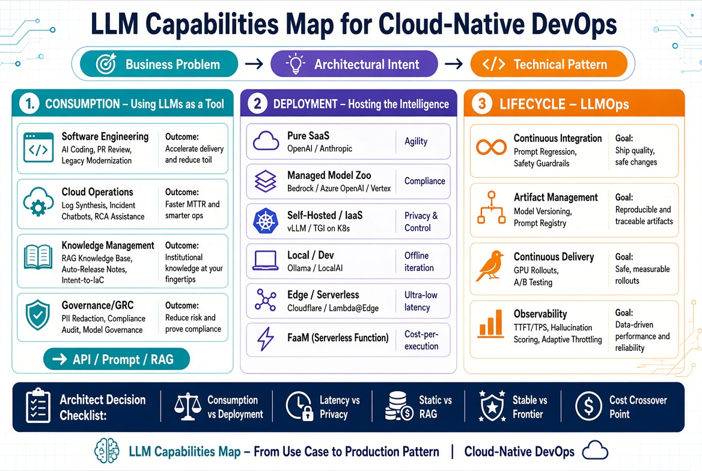

# LLM Capabilities Map for Cloud-Native DevOps

## Learning Objectives

!!! info "Learning Objectives"
    - Map LLM use cases to specific DevOps and Cloud architectural needs, moving from basic consumption to autonomous agents.
    - Distinguish between the operational lifecycles of LLM Consumption, Deployment, and the specialized domain of LLMOps.
    - Identify the correct tooling, infrastructure patterns, and model sizes (Frontier vs. SLM) based on latency, privacy, and complexity requirements.
    - Understand the transition from "Copilot" (Human-in-the-loop) to "Agent" (Human-on-the-loop) patterns in infrastructure management.

## Overview

This document serves as the central synthesis matrix for the Large Language Models (LLM) module. While individual chapters provide deep dives into technical domains, this map organizes capabilities by architectural intent. It is designed to guide engineers and architects from a business problem (e.g., "reduce MTTR") to a technical implementation pattern (e.g., "RAG-augmented autonomous remediation agent").

Figure 1: LLM Capabilities Map for Cloud-Native DevOps.

## The LLM Capability Matrix

### 1. Consumption: "The Intelligence Layer"

*Focus: Applying model intelligence to enhance engineering productivity and operational efficiency.*

| Domain | Use Case | Technical Pattern | Complexity | Expected Outcome |
|---|---|---|---|---|
| **Software Engineering** | AI-Assisted Coding | IDE Plugins $\rightarrow$ LLM API (Copilot pattern) | Low | Reduced boilerplate, faster prototyping |
| | Intelligent PR Review | Webhook $\rightarrow$ LLM $\rightarrow$ PR Comment (Linter pattern) | Medium | Lower defect leakage, consistent style |
| | Legacy Modernization | AST Analysis $\rightarrow$ LLM $\rightarrow$ Refactored Code (Migration pattern) | High | Reduced technical debt, language migration |
| | Test Generation | Requirement $\rightarrow$ LLM $\rightarrow$ Pytest/JUnit (Synthetic Data pattern) | Medium | Higher coverage, edge-case discovery |
| **Cloud Operations** | Log Synthesis | Log Stream $\rightarrow$ LLM Summary $\rightarrow$ Alert (Triage pattern) | Medium | Reduced MTTR, faster incident triage |
| | Autonomous Remediation | Event $\rightarrow$ Agent $\rightarrow$ Tool (kubectl/cli) $\rightarrow$ Fix (Agentic loop) | High | Zero-touch recovery for known failure modes |
| | RCA Assistance | Trace Spans + Metrics $\rightarrow$ LLM $\rightarrow$ Hypothesis (Correlation pattern) | High | Rapid root cause identification |
| **Knowledge Mgmt** | Technical Support | Vector DB $\rightarrow$ RAG $\rightarrow$ Natural Language (Knowledge pattern) | Medium | Self-service technical support |
| | Auto-Release Notes | Git History $\rightarrow$ LLM $\rightarrow$ Stakeholder Markdown (Summarization pattern) | Low | Automated, audience-aware communication |
| | Intent-to-IaC | NL Intent $\rightarrow$ LLM $\rightarrow$ Terraform/Pulumi (Generator pattern) | Medium | Accelerated infrastructure provisioning |
| **Governance/GRC** | PII Redaction | Log Stream $\rightarrow$ LLM Filter $\rightarrow$ Storage (Guardrail pattern) | Medium | Regulatory compliance (GDPR/HIPAA) |
| | Compliance Audit | Config Export $\rightarrow$ LLM $\rightarrow$ Gap Analysis (Audit pattern) | Medium | Continuous compliance posture |
| | Policy-as-Code Gen | Natural Language Policy $\rightarrow$ LLM $\rightarrow$ OPA/Rego (Translation pattern) | High | Faster policy enforcement cycles |

### 2. Deployment: "The Residency Strategy"

*Focus: Architectural decisions regarding model residency, privacy, latency, and the "Crossover Point" between SaaS and Self-hosting.*

| Deployment Model | Residency | Key Tooling | Primary Driver | Trade-off |
|---|---|---|---|---|
| **Pure SaaS** | Provider Cloud | OpenAI API, Anthropic API, Gemini | Agility, High performance | Data privacy risk, Token costs |
| **Managed Model Zoo** | Provider VPC | AWS Bedrock, Azure OpenAI, Vertex AI | Security, Enterprise VPC Integration | Provider lock-in, Limited model choice |
| **Self-Hosted / IaaS** | Private Cloud / K8s | vLLM, TGI, NVIDIA Triton, Ray | Data Sovereignty, Full Weight Control | High Ops overhead, GPU CAPEX |
| **SLM / Local / Dev** | Workstation / Node | Ollama, LocalAI, llama.cpp | Privacy, Low-cost iteration, Offline dev | Limited reasoning capability |
| **Edge / Serverless** | Global POPs | Cloudflare Workers AI, Lambda@Edge | Ultra-low latency, Global distribution | Small model size, Cold starts |
| **Hybrid / Router** | Multi-Cloud | LLM Router $\rightarrow$ (SaaS / Local / SLM) | Cost optimization, Redundancy | Increased architectural complexity |

### 3. Lifecycle: "LLMOps"

*Focus: The specialized DevOps pipelines required to maintain production-grade AI.*

| Lifecycle Stage | Capability | Technical Pattern / Tooling | Critical Metric |
|---|---|---|---|
| **Continuous Integration** | Prompt Regression | Golden Datasets $\rightarrow$ LLM-as-a-Judge (Eval pattern) | Output Stability / Drift |
| | Safety Guardrails | LlamaGuard / NeMo Guardrails (Filter pattern) | Violation Rate |
| **Artifact Mgmt** | Model Versioning | MLflow, DVC, Weights & Biases (Versioning pattern) | Reproducibility |
| | Prompt Registry | Versioned Prompt Templates (GitOps for Prompts) | Prompt-to-Model Alignment |
| **Continuous Delivery** | GPU Orchestration | K8s $\rightarrow$ NVIDIA Device Plugin $\rightarrow$ Helm (Scheduling) | VRAM Utilization / Frag |
| | Model A/B Testing | Traffic Splitting $\rightarrow$ Comparative Eval (Canary pattern) | Win-rate per Model Version |
| **Observability** | LLM Performance | Prometheus $\rightarrow$ TTFT, TPS (Latency pattern) | Time to First Token (TTFT) |
| | Quality Monitoring | Hallucination Scoring $\rightarrow$ Fact-checking (Truthfulness) | Hallucination Rate |
| | Context Optimization | Token-aware Rate Limiters / Cache (Optimization) | Context Window Efficiency |

## The Evolution: From Copilot to Agent

As LLM capabilities mature, the integration pattern in DevOps shifts from passive assistance to active agency:

1. **Copilot (Assistant):** LLM suggests code or explains a log. The human reviews, copies, and executes. (Human-in-the-loop)
2. **Tool-User (Specialist):** LLM is given specific tools (e.g., `get_logs`, `restart_pod`). The human triggers the action and approves the tool call. (Human-led)
3. **Agent (Operator):** LLM is given a goal (e.g., "Fix the 500 errors in production"). The agent plans, executes tools, observes results, and iterates until the goal is met. (Human-on-the-loop)

## Summary Checklist for Architects

### Strategic Alignment

- [ ] **Consumption vs. Deployment:** Are we consuming a frontier API or hosting specialized weights (SLMs) for a specific task?
- [ ] **Latency vs. Privacy:** Does the use case require Edge inference for sub-100ms response or an air-gapped cluster for regulatory compliance?
- [ ] **Static vs. Dynamic Knowledge:** Is the model's parametric knowledge sufficient, or is a RAG (Retrieval Augmented Generation) pipeline required for real-time documentation/logs?
- [ ] **Crossover Point:** Have we calculated when the cost of tokens (SaaS) exceeds the cost of GPU infrastructure (Self-hosted) given our request volume?

### Operational Readiness

- [ ] **Stability Strategy:** Do we have a "Golden Dataset" to detect prompt drift when the provider updates the model version?
- [ ] **Guardrail Implementation:** Are there filters in place to prevent PII leakage into the prompt or "jailbroken" prompts from affecting infrastructure?
- [ ] **Observability:** Are we measuring LLM-specific metrics (TTFT, Tokens/sec) alongside standard system metrics (CPU/RAM)?
- [ ] **Token Budgeting:** Is there a quota/throttling mechanism to prevent a recursive agent loop from consuming the entire monthly token budget in minutes?

## Assignments

!!! note "Assignment.1: From Bottleneck to Agentic Workflow"
    Identify a recurring DevOps bottleneck (e.g., "Onboarding a new developer to a complex K8s environment" or "Triage of noisy Prometheus alerts"). 
    1. Define the **Input** (what data does the LLM need?).
    2. Design the **Toolset** (what CLI tools or APIs should the LLM have access to?).
    3. Map the **Agentic Loop** (Plan $\rightarrow$ Act $\rightarrow$ Observe $\rightarrow$ Refine).
    4. Define the **Success Criterion** (How do we know the agent actually fixed the problem?).

    ??? tip "Solution: Assignment.1"
        A successful solution should identify a specific input (e.g., Prometheus AlertManager webhook payload), a toolset (e.g., `kubectl get pods`, `kubectl logs`, `cloudmesh-cli check-health`), and a clear loop where the LLM analyzes the log, tries a non-destructive diagnostic tool, and updates its hypothesis until it can suggest a specific fix.

!!! note "Assignment.2: The Residency Trade-off Matrix"
    A healthcare provider needs an LLM to analyze patient diagnostic logs for anomalies. The data is subject to strict HIPAA regulations.
    Compare three options:
    - **Option A:** Azure OpenAI (Managed Model Zoo) with HIPAA BAA.
    - **Option B:** Self-hosted Llama-3 on an on-prem GPU cluster.
    - **Option C:** Distilled SLM running on the edge (local clinic servers).
    
    Analyze each based on: **Security/Compliance**, **Inference Latency**, **Operational Overhead**, and **Reasoning Quality**.

    ??? tip "Solution: Assignment.2"
        - **Option A:** High reasoning, low overhead, but requires trusting a third-party BAA (Business Associate Agreement).
        - **Option B:** Maximum security/control, high reasoning, but extremely high operational overhead (GPU management, scaling).
        - **Option C:** Lowest latency, highest privacy, but significantly lower reasoning quality (cannot handle complex edge cases).
        - **Verdict:** Usually Option B or C depending on whether the "analysis" is complex or a simple pattern match.

## References

- [Anthropic Model Documentation](https://docs.anthropic.com/)
- [vLLM Documentation](https://docs.vllm.ai/)
- [NVIDIA Triton Inference Server](https://developer.nvidia.com/triton-inference-server)
- [MLflow LLMOps Guide](https://mlflow.org/docs/latest/llms.html)

## Self-Evaluation

??? note "Q1: What is the 'Crossover Point' in LLM deployment and why does it matter?"
    The crossover point is the volume of requests at which the cost of pay-per-token SaaS pricing exceeds the total cost of ownership (TCO) of self-hosting a model (including GPU hardware, electricity, and engineering overhead). It helps architects decide when to migrate from a managed API to an IaaS/K8s deployment.

??? note "Q2: Explain the difference between a 'Linter' pattern and an 'Agentic' pattern in PR reviews."
    A **Linter pattern** is a one-shot call: `PR Content $\rightarrow$ LLM $\rightarrow$ Comments`. It is static and fast. An **Agentic pattern** is a loop: `PR Content $\rightarrow$ LLM $\rightarrow$ Run Tests $\rightarrow$ Analyze Failure $\rightarrow$ Suggest Fix $\rightarrow$ Repeat`. The agentic pattern can actually verify its suggestions by interacting with the CI pipeline.

??? note "Q3: Why is 'LLM-as-a-Judge' used in LLMOps pipelines instead of simple string matching?"
    LLM outputs are stochastic; the same prompt can yield different but semantically identical answers. String matching (Exact Match) fails frequently. LLM-as-a-Judge uses a more capable "Teacher" model to evaluate if the "Student" model's output is semantically correct, following a predefined rubric.

??? note "Q4: When should you choose an SLM (Small Language Model) over a Frontier Model (e.g., Claude 3.5 Sonnet or GPT-4o)?"
    Choose an SLM when: 
    1. The task is narrow and well-defined (e.g., "convert this log to JSON").
    2. Latency must be ultra-low (edge inference).
    3. Data must never leave a specific node or local network.
    4. Cost is a primary driver for extremely high-volume, low-complexity tasks.
