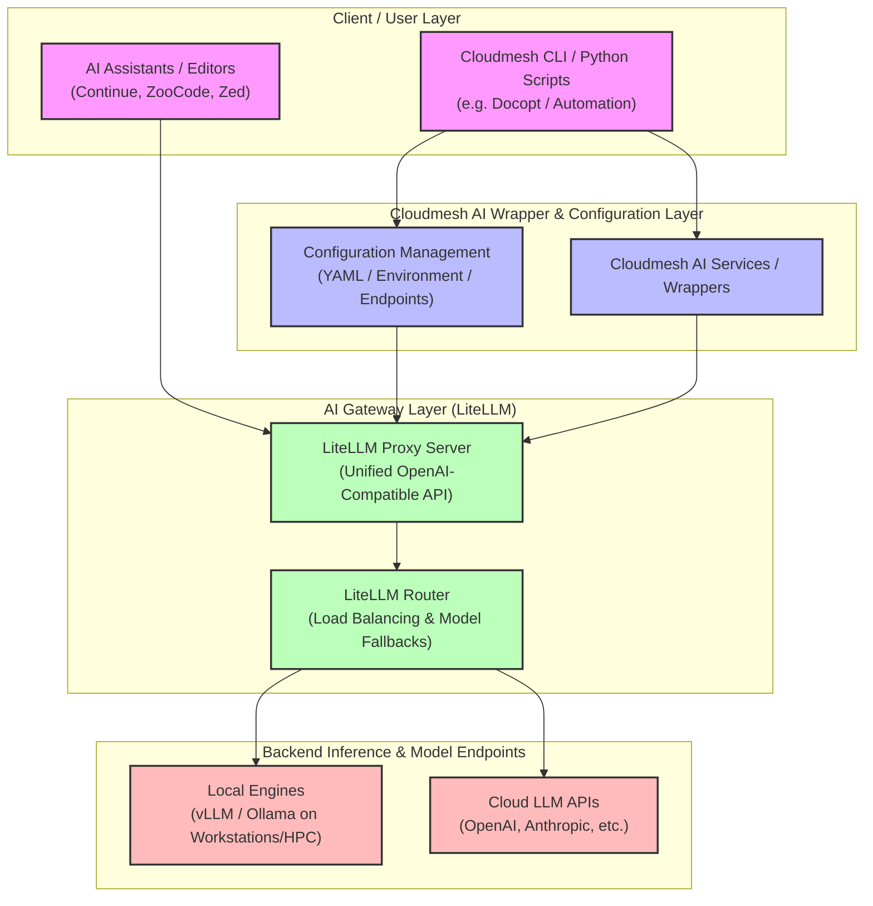
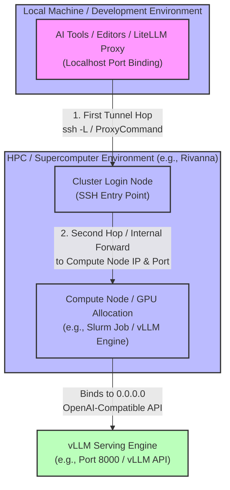

```mermaid
graph TD
    subgraph ClientLayer ["Client / User Layer"]
        CLI["Cloudmesh CLI / Python Scripts<br/>(e.g. Docopt / Automation)"]
        Apps["AI Assistants / Editors<br/>(Continue, ZooCode, Zed)"]
    end

    subgraph IntegrationLayer ["Cloudmesh AI Wrapper & Configuration Layer"]
        CM_Config["Configuration Management<br/>(YAML / Environment / Endpoints)"]
        CM_Service["Cloudmesh AI Services / Wrappers"]
    end

    subgraph GatewayLayer ["AI Gateway Layer (LiteLLM)"]
        LiteLLM_Proxy["LiteLLM Proxy Server<br/>(Unified OpenAI-Compatible API)"]
        LiteLLM_Router["LiteLLM Router<br/>(Load Balancing & Model Fallbacks)"]
    end

    subgraph BackendLayer ["Backend Inference & Model Endpoints"]
        LocalInference["Local Engines<br/>(vLLM / Ollama on Workstations/HPC)"]
        CloudProviders["Cloud LLM APIs<br/>(OpenAI, Anthropic, etc.)"]
    end

    %% Connections
    CLI --> CM_Config
    CLI --> CM_Service
    Apps --> LiteLLM_Proxy

    CM_Config --> LiteLLM_Proxy
    CM_Service --> LiteLLM_Proxy

    LiteLLM_Proxy --> LiteLLM_Router
    
    LiteLLM_Router --> LocalInference
    LiteLLM_Router --> CloudProviders

    classDef client fill:#f9f,stroke:#333,stroke-width:2px;
    classDef cloudmesh fill:#bbf,stroke:#333,stroke-width:2px;
    classDef litellm fill:#bfb,stroke:#333,stroke-width:2px;
    classDef backend fill:#fbb,stroke:#333,stroke-width:2px;

    class CLI,Apps client;
    class CM_Config,CM_Service cloudmesh;
    class LiteLLM_Proxy,LiteLLM_Router litellm;
    class LocalInference,CloudProviders backend;
```

```mermaid
graph TD
    subgraph LocalClient ["Local Machine / Development Environment"]
        ClientApps["AI Tools / Editors / LiteLLM Proxy<br/>(Localhost Port Binding)"]
    end

    subgraph ClusterNetwork ["HPC / Supercomputer Environment (e.g., Rivanna)"]
        LoginNode["Cluster Login Node<br/>(SSH Entry Point)"]
        ComputeNode["Compute Node / GPU Allocation<br/>(e.g., Slurm Job / vLLM Engine)"]
    end

    %% Tunnelling & Networking Flow
    ClientApps -->|1. First Tunnel Hop<br/>ssh -L / ProxyCommand| LoginNode
    LoginNode -->|2. Second Hop / Internal Forward<br/>to Compute Node IP & Port| ComputeNode
    
    ComputeNode -->|Binds to 0.0.0.0<br/>OpenAI-Compatible API| vLLMService["vLLM Serving Engine<br/>(e.g., Port 8000 / vLLM API)"]

    classDef local fill:#f9f,stroke:#333,stroke-width:2px;
    classDef cluster fill:#bbf,stroke:#333,stroke-width:2px;
    classDef engine fill:#bfb,stroke:#333,stroke-width:2px;

    class ClientApps local;
    class LoginNode,ComputeNode cluster;
    class vLLMService engine;
```