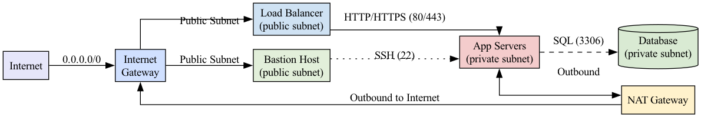

# Networking for Cloud Computing

!!! info "Learning Objectives"
    - Understand the fundamental layers of networking (OSI and TCP/IP).
    - Master Cloud Networking components (VPC, Subnets, Gateways, Route Tables).
    - Understand CIDR notation and IP address allocation.
    - Implement a secure networking strategy using Security Groups and NACLs.
    - Design a scalable and resilient cloud network architecture.

---

## 1. The Foundations of Networking

Networking is the "glue" of cloud computing. Whether you are deploying a simple website or a complex microservices architecture, the way data moves between your components determines the security, performance, and reliability of your application.

### The OSI Model vs. TCP/IP Stack

To understand networking, we use conceptual models. The **OSI (Open Systems Interconnection)** model is the gold standard for education, breaking down the complex process of sending data into seven distinct layers. 

#### How Data Moves: Encapsulation
When you send a request (e.g., typing `https://google.com` in a browser), your data undergoes **encapsulation**. It starts at the top layer (Application) and moves down. Each layer adds its own "header" (metadata) to the data, like putting a letter inside multiple envelopes.
- The **Transport layer** adds a TCP header (port numbers).
- The **Network layer** adds an IP header (source and destination IP).
- The **Data Link layer** adds a MAC address.

Once the data reaches the destination, it undergoes **de-encapsulation**, stripping away the headers layer by layer until the original request reaches the application.

| OSI Layer | Name | Primary Function | Typical Protocols / Devices | Security Focus |
|-----------|------|------------------|-----------------------------|----------------|
| 7 | **Application** | End-user services | HTTP/HTTPS, DNS, SMTP, MySQL | TLS, API Gateways, Input Validation |
| 6 | **Presentation**| Data representation | TLS/SSL, JPEG, XML/JSON | Encryption in-flight, Cipher suites |
| 5 | **Session** | Connection state | NetBIOS, RPC, SIP | Session timeouts, Re-authentication |
| 4 | **Transport** | End-to-end reliability | TCP, UDP | TCP-reset alerts, Port limiting |
| 3 | **Network** | Routing & Addressing | IP, ICMP, IPv4/IPv6 | ACLs, Router hardening, IP filtering |
| 2 | **Data Link** | Local frame delivery | Ethernet, Wi-Fi, ARP | VLANs, Port security, MAC filtering |
| 1 | **Physical** | Physical medium | Cables, NICs, Switches | Physical security, Cable monitoring |

**Cloud Simplification**: In the real world, and specifically in cloud documentation (AWS/Azure/GCP), the OSI model is often collapsed into the **TCP/IP stack**, which consists of four layers: **Application**, **Transport**, **Internet**, and **Link**.

---

## 2. The Four-Layer TCP/IP Model (Cloud Standard)

While the 7-layer OSI model is an academic standard, the cloud industry and the actual internet operate on a more practical, streamlined model: the **TCP/IP Model**.

### Why the Simplification?
The OSI model was developed as a theoretical framework. However, the TCP/IP model was developed to make the internet *work*. 

In a software-defined cloud environment:
- The distinctions between the Session, Presentation, and Application layers are blurred because they are almost always handled by the same piece of software (the application code or a library).
- The physical cable and the data link (the way bits are framed) are handled by the cloud provider's underlying infrastructure, making them functionally a single "Link" layer from the user's perspective.

### Detailed Breakdown of the Four Layers

#### Layer 4: The Application Layer
This layer is the top of the stack. It combines the functions of the OSI's Application, Presentation, and Session layers. 
- **Function**: Defines the protocols that applications use to exchange data.
- **Cloud Context**: This is where your APIs live. When you configure a **Layer 7 Load Balancer (ALB)**, you are operating at this layer. The load balancer can "see" the HTTP headers, the URL path, and the cookies to make routing decisions.
- **Common Protocols**: HTTP, HTTPS, DNS, SMTP, FTP, SSH.

#### Layer 3: The Transport Layer
This layer is responsible for end-to-end communication and reliability.
- **Function**: Handles segmentation, flow control, and error checking.
- **Cloud Context**: This is where you configure **Security Group rules** for specific ports (e.g., Port 80 for HTTP, Port 22 for SSH). A **Layer 4 Load Balancer (NLB)** operates here; it only looks at the IP and Port and forwards the packets as fast as possible without looking at the content.
- **Common Protocols**: TCP (Reliable, connection-oriented), UDP (Fast, connectionless).

#### Layer 2: The Internet Layer
This layer is responsible for routing packets across different networks.
- **Function**: Determines the best path for data to travel from the source IP to the destination IP.
- **Cloud Context**: This is the realm of the **VPC**, **Subnets**, and **Route Tables**. When you define a CIDR block or a route to an Internet Gateway (IGW), you are operating at the Internet Layer.
- **Common Protocols**: IP (IPv4, IPv6), ICMP (used for `ping` and `traceroute`), ARP.

#### Layer 1: The Link Layer (Network Access)
This layer combines the OSI's Physical and Data Link layers.
- **Function**: Handles MAC addressing and the framing of data for physical transmission.
- **Cloud Context**: In the cloud, this layer is mostly abstracted away. You don't manage the physical switches or the fiber cables. However, it is still present in the form of **Virtual NICs (vNICs)** and the underlying SDN (Software-Defined Network) that maps your virtual IP to a physical host in the provider's data center.
- **Common Technologies**: Ethernet, Wi-Fi (802.11), Fiber Optics.

### Comparison Mapping: OSI vs. TCP/IP

| TCP/IP Layer | OSI Equivalent | Primary Focus | Cloud Example |
|--------------|----------------|----------------|----------------|
| **Application** | Application + Presentation + Session | Data & User Interface | HTTP Request / API Call |
| **Transport** | Transport | Reliability & Ports | TCP Port 443 / NLB |
| **Internet** | Network | Routing & IP Addressing | VPC Route Table / Subnet |
| **Link** | Data Link + Physical | Physical Transmission | Virtual NIC / Ethernet |

### Practical Application: L4 vs. L7 Load Balancers

Choosing between different types of load balancers is a critical cloud architecture decision.

#### Layer 4 (L4) Load Balancing (Network Load Balancer)
- **Operating Layer**: Transport Layer.
- **What it sees**: Source IP, Destination IP, and Port.
- **Behavior**: It simply forwards packets. It does not "open" the packet to see what's inside.
- **Pros**: Extremely fast, low latency, handles millions of requests per second.
- **Cons**: Cannot route based on URL paths.

#### Layer 7 (L7) Load Balancing (Application Load Balancer)
- **Operating Layer**: Application Layer.
- **What it sees**: Everything in the packet, including HTTP headers, Cookies, and URL paths.
- **Behavior**: It terminates the connection, reads the request, and then opens a new connection to the backend server.
- **Pros**: Intelligent routing (Path-based or Host-based routing).
- **Cons**: Slower than L4 because it must perform deep packet inspection.

---

## 3. Cloud Networking Building Blocks

In a traditional data center, networking involves physical switches, cables, and hardware firewalls. In the cloud, we use **Software-Defined Networking (SDN)**. This means you define your network through an API or a console, and the cloud provider handles the underlying hardware.

### The Virtual Private Cloud (VPC)
A **VPC** is your own isolated section of the cloud provider's network. Think of it as a virtual data center. Within this boundary, you have complete control over:
- Your own IP address range.
- The creation of subnets.
- The routing tables that direct traffic.
- The network gateways that connect you to the outside world.

### Core Components and Their Roles


Below is a **single “Unified Core‑Networking Building Blocks” table** that merges the two markdown tables you posted.  

*All columns from the originals are kept, so you get the plain‑English description, the high‑level purpose (the “cloud role”), the vendor‑specific names, and the security‑hardening notes – all on one line for each component.*  

| Component | Description (what it is) | Typical Cloud Service/Tool Name(s) | Role / Cloud Role (high‑level purpose) | Security‑focused notes |
|-----------|---------------------------|-----------------------|----------------------------------------|------------------------|
| **Virtual Private Cloud (VPC) / Virtual Network** | Isolated logical network that owns a CIDR block. | VPC (AWS) • VNet (Azure) • VPC (GCP) | Provides a private address space and security boundary. | Give each environment its own CIDR; avoid overlapping ranges. |
| **Subnet** | A contiguous range of IP addresses inside a VPC. | Subnet (AWS / Azure / GCP) | Segments workloads into **Public** and **Private** zones. | Put only internet‑facing services in public subnets; keep private subnets hidden. |
| **Internet Gateway (IGW)** | Router that connects a VPC to the public Internet. | IGW (AWS) • Internet gateway (Azure) • Internet gateway (GCP) | Enables inbound & outbound traffic for public subnets. | Attach only to VPCs that truly need inbound traffic. |
| **NAT Gateway / NAT Instance** | Translates private IPs to a public IP (source‑NAT) so private resources can reach the Internet (outbound‑only). | NAT Gateway (AWS / Azure) • Cloud NAT (GCP) | Allows private resources outbound Internet access only. | Use a managed NAT for HA; block any inbound traffic on the NAT. |
| **Route Table** | Set of CIDR‑to‑target rules (IGW, NAT, peering, VPN, etc.). | Route Table (AWS / Azure / GCP) | The “brain” that decides where packets go. | Keep the default `0.0.0.0/0` route limited to an IGW (public) **or** a NAT (private) as appropriate. |
| **Security Group** | Stateful, instance‑level firewall. | Security Group (AWS) • NSG (Azure) • Firewall Rules (GCP) | Provides fine‑grained inbound/outbound filtering per workload. | Use **allow‑only** rules; deny is implicit. Scope to the least‑privileged ports/IPs. |
| **Network ACL (NACL)** | Stateless, subnet‑level firewall. | NACL (AWS) • (Azure combines with NSG) • VPC firewall rules (GCP) | Adds a second line of defense at the subnet border. | Good for “deny‑first” rules (e.g., block all inbound then allow specific ports). |
| **Load Balancer** | Distributes incoming traffic across a pool of targets. | ELB/ALB/NLB (AWS) • Azure Load Balancer • Cloud Load Balancing (GCP) | Ensures high availability and prevents server overload. | Enable health checks; attach a WAF for L7 protection. |
| **DNS** | Managed naming service that maps friendly names to IP addresses. | Route 53 (AWS) • Azure DNS • Cloud DNS (GCP) | Maps friendly URLs (e.g., `example.com`) to IP addresses. | Use private hosted zones for internal services; enable DNSSEC for public zones. |
| **Firewall (Next‑Gen, WAF)** | Deep‑packet inspection & application‑layer protection. | AWS Network Firewall • Azure Firewall • GCP Cloud Armor | Provides L3‑L7 protection and policy enforcement. | Block known bad IPs, enforce rate‑limits, inspect TLS traffic with inspection certificates. |
| **VPN / Direct Connect** | Encrypted or dedicated private link between on‑premise (or another cloud) and the VPC. | Site‑to‑Site VPN • Azure ExpressRoute • AWS Direct Connect | Connects on‑premise data centers to the cloud VPC. | Use strong IKEv2/IPSec; route only the subnets that truly need connectivity. |
| **VPC Peering / Transit Gateway** | Private connectivity between VPCs (or many networks). | VPC Peering • Transit Gateway (AWS) • Azure Virtual WAN • GCP Network Connectivity Center | Allows separate networks to talk privately without using the public Internet. | Avoid transitive routing loops; centralize egress via a shared NAT/Firewall. |
| **Service Mesh / SDN** | Programmable, fine‑grained traffic control for micro‑services (mTLS, zero‑trust, observability). | Istio • AWS App Mesh • Azure Service Mesh • GCP Anthos Service Mesh | Adds application‑level networking intelligence on top of the base infra. | Enforce mutual TLS, zero‑trust policies, and request‑level observability. |


### Understanding Subnet Logic: Public vs. Private
The difference between a public and private subnet is not a "setting" on the subnet itself, but rather the **Route Table** associated with it.
- **Public Subnet**: Has a route in its table that directs non-local traffic (`0.0.0.0/0`) to the **Internet Gateway (IGW)**.
- **Private Subnet**: Does NOT have a route to the IGW. To reach the internet (e.g., for software updates), it must send traffic to a **NAT Gateway** located in a public subnet.

---

## 4. Understanding IP Addressing and CIDR

To manage a network, you must be able to carve out IP address spaces. We do this using **CIDR (Classless Inter-Domain Routing)**.

### How CIDR Works
An IPv4 address consists of 32 bits. CIDR notation (`x.x.x.x/n`) tells us how many of those bits are "locked" as the network address.
- The `/n` (prefix) is the network portion.
- The remaining bits (`32 - n`) are available for hosts (individual devices).

For example, in a `/24` network, the first 24 bits are fixed. This leaves 8 bits for hosts. $2^8 = 256$. So, a `/24` block contains 256 IP addresses.

### Common CIDR Blocks and Their Sizes

| CIDR | Fixed Bits | Host Bits | Total IPs | Typical Use Case |
|------|------------|-----------|-----------|-------------------|
| `/8` | 8 | 24 | 16,777,216 | Massive enterprise internal networks. |
| `/16` | 16 | 16 | 65,536 | Standard size for a single cloud VPC. |
| `/24` | 24 | 8 | 256 | A single subnet within a VPC. |
| `/27` | 27 | 5 | 32 | A small group of specialized servers. |
| `/32` | 32 | 0 | 1 | A single specific host (used in firewall rules). |
| `/0` | 0 | 32 | 4.2 Billion | The entire Internet. Use with extreme caution. |

**Pro Tip**: When designing a VPC, always leave room for growth. If you use a `/24` for your entire VPC and your company grows, you will have to recreate the entire network because you cannot easily "expand" a CIDR block.

---

## 5. Network Security: Controlling the Flow

Cloud security follows the principle of **Defense in Depth**. Instead of relying on one big firewall at the edge, we apply security at multiple layers.

### Security Groups vs. Network ACLs (NACLs)

The most common point of confusion is the difference between Security Groups and NACLs.

#### 1. Security Groups (The "Door" to the Instance)
Security Groups act as a virtual firewall for your **individual instances** (VMs). 
- **Stateful**: This is the most important feature. If you allow an inbound request on port 80, the Security Group "remembers" this connection and automatically allows the response to go back out, regardless of outbound rules.
- **Allow-only**: You only define what is *allowed*. Everything else is denied by default.

#### 2. Network ACLs (The "Gate" to the Subnet)
NACLs act as a firewall for the **entire subnet**.
- **Stateless**: NACLs have no memory. If you allow inbound traffic on port 80, you **must** also explicitly create an outbound rule to allow the response to leave the subnet.
- **Allow and Deny**: You can explicitly block specific IP addresses (e.g., blocking a known malicious actor).

| Feature | Security Groups | Network ACLs (NACLs) |
|---------|------------------|----------------------|
| **Level** | Instance/NIC level | Subnet level |
| **State** | **Stateful** | **Stateless** |
| **Rules** | Allow rules only | Allow and Deny rules |
| **Scope** | Applied to specific VMs | Applied to the whole subnet |

### The Danger of `0.0.0.0/0`
The CIDR `0.0.0.0/0` means "Anywhere on the Internet." 
- **Acceptable**: For public web ports (80/443) on a Load Balancer.
- **Dangerous**: For SSH (22), RDP (3389), or Database ports (3306, 5432). 

Opening these ports to the world makes your servers visible to automated botnets that scan the entire internet for open ports to launch brute-force attacks.


### 3. Security‑Group vs. Firewall vs. Network‑ACL – When to Use Which?

Now we have introduced 3 concepts for secuering the services. But which should we use when. The following table provides a good starting point to answer this question

| Feature | Security Group | Network ACL | Managed Firewall (NGFW/WAF) |
|---------|----------------|------------|-----------------------------|
| **Stateful?** | Yes (return traffic auto‑allowed) | No (stateless) | Yes (full connection tracking) |
| **Scope** | Instance / ENI level | Subnet level | VPC / per‑region level |
| **Rule Granularity** | Protocol, port, source/destination IP (allow only) | Protocol, port, CIDR (allow/deny) | Application‑layer (HTTP, SQL injection, XSS) |
| **Typical Use** | Fine‑tuned host‑level allow lists (e.g., allow LB → app on 443) | Broad “deny‑all‑except” for a whole subnet (e.g., block all inbound to a data‑layer subnet) | Central egress/ingress inspection, DDoS protection, WAF for web apps |
| **Performance** | Very low latency (in‑hypervisor) | Slightly higher (applies to each packet) | May add latency (deep inspection) but offers richer security |

**Best‑practice pattern**  
1. **Security Group** – whitelist only required ports/IPs.  
2. **Network ACL** – “deny‑all” inbound on the private subnet; explicitly allow the SG‑controlled traffic.  
3. **Managed Firewall / WAF** – place at the VPC edge (IGW or Transit Gateway) for logging, threat intel feeds, and L7 protection.


---

## 6. Designing a Typical Cloud Web Architecture

A professional production environment is designed to minimize the **Attack Surface**. The goal is to ensure that no database or application server is ever directly reachable from the public internet.

### The Three-Tier Architecture
1.  **Public Tier (The Entry Point)**:
    - **Load Balancer**: Receives traffic from the internet and distributes it.
    - **Bastion Host (Jumpbox)**: A tiny, highly secured server that admins use to SSH into the private servers. It is the only "door" into the private network.
2.  **Application Tier (The Logic)**:
    - **App Servers**: These live in a **Private Subnet**. They only accept traffic from the Load Balancer.
3.  **Database Tier (The Data)**:
    - **Databases**: These live in the most restricted **Private Subnet**. They only accept traffic from the Application Tier.

### Request Journey Example
1. **User** $\rightarrow$ Requests `example.com` $\rightarrow$ **Internet Gateway**.
2. **Internet Gateway** $\rightarrow$ Routes to **Load Balancer** (Public Subnet).
3. **Load Balancer** $\rightarrow$ Checks health and forwards to **App Server** (Private Subnet).
4. **App Server** $\rightarrow$ Queries **Database** (Database Subnet).
5. **Database** $\rightarrow$ Returns data $\rightarrow$ **App Server** $\rightarrow$ **Load Balancer** $\rightarrow$ **User**.

---


## 7. Security‑Hardening Checklist 

It is handy to create a security checklist. The following may inspire you with some checks you want to conduct to see if your security is harened.

To practivcall use it :

1. **Paste it into your documentation repository** (e.g., `SECURITY_CHECKLIST.md`).  
2. **Augment** the table as neccesary with your architectural designs.
3. **Mark items as complete** by with `- [x]` and add a timestamp when that audit has been conducted.  
4. **Automate verification where possible**:  
   * Small scripts (AWS CLI, Azure CLI, GCP `gcloud`) can query the current state and output “PASS/FAIL” for each row.  
   * Hook those scripts into CI/CD pipelines or a scheduled audit job.  
5. **Review quarterly** or whenever a major network change is planned to keep the checklist current.


|  | **Category** | **Checklist Item** | **Recommended Setting / Implementation** | **Why It Matters (Rationale)** | **How to Verify / Test** |
|---|--------------|--------------------|------------------------------------------|--------------------------------|---------------------------|
| 1 [-] | **Network Segmentation** | Separate CIDR ranges per environment (prod, dev, test) | Assign non‑overlapping CIDRs (e.g., `10.0.0.0/16` Prod, `10.1.0.0/16` Dev, `10.2.0.0/16` Test) | Prevents routing conflicts & accidental cross‑talk; simplifies VPC peering | `aws ec2 describe-vpcs` → confirm CIDR blocks don’t intersect (or similar CLI in Azure/GCP) |
| 2 [-]| **Subnet Design** | Keep only load balancers & bastion hosts in public subnets | Public subnet hosts: ALB/NLB, bastion (SSH jump). All other tiers → private subnets | Reduces attack surface – only a handful of IP‑exposed resources | Inspect subnet route tables – only IGW attached to public subnets; private subnets point to NAT/IGW as appropriate |
| 3 [-]| **Security Groups – Least Privilege** | Restrict inbound traffic to specific ports & source SGs | • DB tier SG: inbound `3306` from App‑tier SG only  <br>• App tier SG: inbound `443/80` from ALB SG only  <br>• No `0.0.0.0/0` except for public web ports | Minimises blast‑radius if a host is compromised | `aws ec2 describe-security-groups` – ensure no wide‑open rules |
| 4 [-]| **Network ACLs – Second Line of Defense** | Deny‑all inbound/outbound on private subnets, then allow only needed traffic | Example: <br>• Inbound allow VPC CIDR on needed ports  <br>• Outbound allow VPC CIDR + NAT GW | Provides stateless, subnet‑level protection beyond SGs | `aws ec2 describe-network-acls` – confirm default deny‑all plus explicit allow rules |
| 5 [-]| **Internet Egress** | Use Managed NAT Gateways (or NAT Instances only for dev) | Deploy NAT GW in each AZ, attach route‑table for private subnets | HA, auto‑scaling, no single‑point‑of‑failure | `aws ec2 describe-nat-gateways` – status = `available` |
| 6 [-]| **Load Balancer Configuration** | Enable health checks **and** attach a WAF | • HTTP/HTTPS health checks on a specific path (e.g., `/healthz`)  <br>• AWS WAF (or Azure / GCP equivalent) with OWASP‑Top‑10 rule‑set | Prevents traffic to unhealthy nodes & blocks common web attacks before they hit the app | ALB → “Health Check” tab shows healthy targets; WAF → “WebACL” shows rules attached |
| 7 [-]| **Monitoring & Observability** | Enable VPC Flow Logs (and NSG flow logs where applicable) → ship to CloudWatch / a SIEM | Capture all accepted/rejected IP‑port traffic for forensic analysis | Gives visibility to detect anomalies, audit compliance | `aws ec2 describe-flow-logs` – verify log group exists and receives data |
| 8 [-]| **Patch & Update Management** | Automate OS/agent patching (SSM Patch Manager, Azure Update Management, etc.) | Apply security patches on a schedule; rotate SG rules after changes | Reduces exposure to known CVEs; avoids stale rules | Run a patch‑compliance report; review SG change‑history logs |
| 9 [-]| **Identity & Access Management** | Restrict who can create/modify networking objects (VPC, SG, NACL, NAT) via IAM policies / role‑based access | Use least‑privilege IAM roles, MFA, and an approval workflow (e.g., ticket) | Prevents accidental or malicious mis‑configuration | IAM policy simulation (`aws iam simulate-principal-policy`) or Azure AD role review |
|10 [-]| **Documentation & Change Control** | Keep a living “Network Architecture Diagram” and a “Change Log” for all networking changes | Store in a version‑controlled repo (Git) and link each change to a ticket ID | Guarantees knowledge transfer and audit trail | Review repo commit history; confirm every change is ticket‑referenced |

## Appendix: Further Learning Resources  

| Platform | Resource | What You’ll Learn |
|----------|----------|-------------------|
| **AWS** | *AWS Networking Fundamentals* (digital training) | VPC, subnets, IGW, NAT, Transit Gateway, Direct Connect. |
| **Azure** | *Azure Virtual Network documentation* | VNets, subnets, NSGs, Azure Firewall, VPN Gateway. |
| **GCP** | *Google Cloud VPC Overview* | VPC design, Cloud Router, Private Google Access, Cloud NAT. |
| **Books** | *Cloud Native Networking* by Michael Hausenblas (O'Reilly) | Service meshes, SDN, multi‑cluster networking. |
| **Hands‑On Labs** | *Qwiklabs* / *A Cloud Guru* labs for VPC creation, peering, and load‑balancer configuration. | Real‑world practice in a sandbox environment. |
| **Certification** | *AWS Certified Advanced Networking – Specialty* | Deep dive into hybrid connectivity, security, and high‑availability patterns. |

## Appendix: Which CIDR?

The following guide gives a quick overview how to chose the CIDR.


| Decision factor | Guidance |
|-----------------|----------|
| **Is the service meant for the public?** | Only ports 80/443 (or any other public‑API port you deliberately expose) should use `0.0.0.0/0`. |
| **Do you have a bastion host or jump box?** | Point the rule at the bastion’s *private* subnet CIDR (e.g., `10.0.1.0/24`). |
| **Is the client a known static IP?** | Use a `/32` rule (single IP) – `203.0.113.45/32`. |
| **Are you allowing an entire VPC/Subnet?** | Use the VPC CIDR (`10.0.0.0/16`) or the specific subnet CIDR (`10.0.2.0/24`). |
| **Do you need temporary access?** | Create a *time‑boxed* rule (many cloud consoles let you add an expiration timestamp). |
| **Do you need to allow a whole ISP range?** | Prefer a *deny‑by‑default* approach and add explicit allow for the ISP’s CIDRs only if absolutely required. |


## Appendix: Assignments
---


!!! Assignment "Networking Assignment 1"

    Research the different applications running on the different ports. Give a short explanation of what they do. Explain why one is good and the other is bad. Are there other settings or alternative settings that should be used?

    **What a "good" rule looks like**

    | Port | Protocol | Allowed Source CIDR | Reason |
    |------|----------|---------------------|--------|
    | 22 (SSH) | TCP | `203.0.113.45/32` (your admin IP) | Only the admin’s static IP can SSH. |
    | 22 (SSH) | TCP | `10.0.0.0/16` (internal VPC) | Allows bastion‑host‑to‑instance SSH, but not the Internet. |
    | 443 (HTTPS) | TCP | `0.0.0.0/0` | Public web traffic must be reachable from everywhere. |
    | 3306 (MySQL) | TCP | `10.0.2.0/24` (app‑tier subnet) | Database only accepts connections from the application servers. |
    | 3389 (RDP) | TCP | `198.51.100.0/24` (corporate office range) | Remote‑desktop only from corporate LAN. |

  
    **What a "bad" rule looks like**

    | Port | Protocol | Source CIDR | Why it’s risky |
    |------|----------|-------------|----------------|
    | 22 (SSH) | TCP | `0.0.0.0/0` | Anyone can attempt a brute‑force SSH login. |
    | 3306 (MySQL) | TCP | `0.0.0.0/0` | External attackers can scan for the DB and enumerate data. |
    | 3389 (RDP) | TCP | `0.0.0.0/0` | RDP is a high‑value target; open to the world invites ransomware attacks. |
    | 8080 (Custom API) | TCP | `0.0.0.0/0` | If the API isn’t meant to be public, you expose it to DoS and credential‑stuffing. |


!!! Assignment "Network Assignment 2"

    The following Python program conducts a simple check on a CIDR block to help you understand how many IP addresses are available in different configurations.

    ```python
    import ipaddress
    cidr = ipaddress.ip_network('10.0.0.0/16')
    print(f\"Network bits: {cidr.prefixlen}\")
    print(f\"Host bits: {32 - cidr.prefixlen}\")
    print(f\"Total IPs: {cidr.num_addresses}\")
    ```

    **Task**: Execute this code and try different combinations (e.g., `/8`, `/24`, `/28`, `/32`). Observe how the number of available IPs changes drastically with just a small change in the prefix number.

    !!! tip \"Solution\"

        ```
        Network bits: 16
        Host bits: 16
        Total IPs: 65536
        ```

        The Python functions show that a `/16` block contains **65,536** IP addresses, with 16 bits dedicated to the network portion and 16 bits available for host addresses. This makes it a common choice for medium-sized private networks (e.g., a VPC, a departmental subnet, or a campus-wide address space).


!!! Assignment "Networking Assignment 3"


    The script below shows how you can **audit** a list of security‑group rules and flag any rule that uses `0.0.0.0/0` on a non‑web port. It also prints the number of IP addresses contained in each allowed CIDR, which helps you understand how “wide” a rule really is.

    ```python
    import ipaddress
    from tabulate import tabulate

    # Sample security‑group rules (port, protocol, source CIDR)
    rules = [
        (22, "tcp", "0.0.0.0/0"),          # bad
        (80, "tcp", "0.0.0.0/0"),          # acceptable (public web)
        (443, "tcp", "0.0.0.0/0"),         # acceptable (public web)
        (3306, "tcp", "10.0.0.0/16"),      # good (internal only)
        (22, "tcp", "203.0.113.45/32"),    # good (single admin IP)
        (3389, "tcp", "0.0.0.0/0"),        # bad
        (8080, "tcp", "198.51.100.0/24")   # depends – not a standard web port
    ]

    def cidr_size(cidr):
        """Return the total number of IP addresses the CIDR contains."""
        net = ipaddress.ip_network(cidr, strict=False)
        return net.num_addresses

    def is_public_web_port(port):
        return port in (80, 443)

    def analyse_rules(rules):
        rows = []
        for port, proto, src in rules:
            size = cidr_size(src)
            issue = ""
            # Flag anything that is 0.0.0.0/0 on a non‑web port
            if src == "0.0.0.0/0" and not is_public_web_port(port):
                issue = "⚠️  Too open (non‑web port)"
            rows.append([port, proto.upper(), src, f"{size:,}", issue])
        return rows

    table = analyse_rules(rules)
    print(tabulate(table, headers=["Port", "Proto", "Source CIDR", "IP Count", "Problem"], tablefmt="github"))
    ```

    **Result**

    ```
    |   Port | Proto   | Source CIDR      |   IP Count | Problem                     |
    |--------|----------|------------------|------------|----------------------------|
    |     22 | TCP      | 0.0.0.0/0        | 4,294,967,296 | ⚠️  Too open (non‑web port) |
    |     80 | TCP      | 0.0.0.0/0        | 4,294,967,296 |                            |
    |    443 | TCP      | 0.0.0.0/0        | 4,294,967,296 |                            |
    |   3306 | TCP      | 10.0.0.0/16      |      65,536 |                            |
    |     22 | TCP      | 203.0.113.45/32  |           1 |                            |
    |   3389 | TCP      | 0.0.0.0/0        | 4,294,967,296 | ⚠️  Too open (non‑web port) |
    |    8080 | TCP      | 198.51.100.0/24  |        256 |                            |
    ```

    **Question:**

    How can the output from this program be interpreted?

    !!! tip "Solution"

        * The two rows flagged with **⚠️** are risky because they expose **SSH** (22) and **RDP** (3389) to the entire Internet.  
        * Port 80/443 are allowed from `0.0.0.0/0`—that is fine for some public web services.  
        * The rule `203.0.113.45/32` allows only a single IP, which is the most restrictive (only **1** address).  
        * The internal DB rule `10.0.0.0/16` still contains 65 536 addresses, but it is limited to the private VPC space, which is **not reachable from the public Internet**.  

!!! Assignment "Networking Assignment 4"

    What should I do if I am constantly pinged, probed, and I detect logins from an IP address that has no need to access my "public" service?

    * Why is the 0.0.0.0 IP sometimes a bad idea? 
    * How can this be prevented? 
    * How can you block IP addresses from a specific country? 
    Why would they be able to mask that they are from a specific country or IP address range?

    !!! tip
        Research how to set up firewalls in Linux and apply the rules to the given IP or IP ranges.
        Show the explicit rule.

!!! Assignment "Network Assignment 5: Architecture"


    Given the following diagram, explain what each component is and come up with an example application that needs such an architecture.

    

    As you have by now identified 

    1. **Public subnet** holds the Load Balancer (LB) and optionally a bastion host.  
    2. **Private subnet** holds application servers, databases, and any services that should not be directly reachable.  
    3. **NAT Gateway** lives in a public subnet, lets private instances initiate outbound connections (e.g., `apt-get update`).  
    4. **Security Groups** lock down ports (e.g., LB allows 80/443 inbound; app SG allows traffic only from LB).  
    5. **Route Tables** send `0.0.0.0/0` from public subnets to the IGW and from private subnets to the NAT.  

    **Question 1:** Explain the "concrete" application and conduct a security audit.

    **Question 2:** If the application is run in a university, how do the security requirements need to be changed?