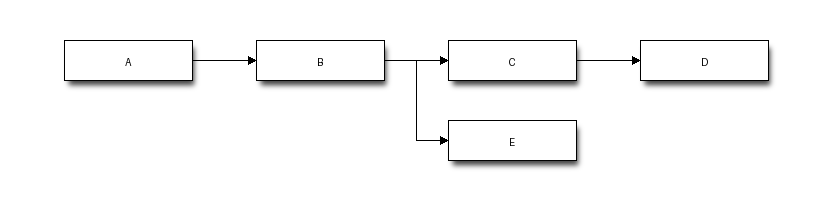

!!! info "Learning Outcomes"
    - Programmatically generate system architecture and infrastructure diagrams using Python libraries like `diagrams`, `blockdiag`, and `matplotlib`.
    - Analyze the Flask request-response lifecycle and AWS web service topologies through visual blueprints.
    - Implement custom layout plotting scripts to visualize server inventory and rack configurations dynamically.
    
## The Flask Request-Response Cycle

The following diagram illustrates how a Flask application handles an incoming request using the `diagrams` Python library.

```{python}
#| echo: true
from diagrams import Diagram, Cluster, Edge
from diagrams.onprem.client import Users
from diagrams.onprem.network import Nginx
from diagrams.programming.language import Python
from diagrams.onprem.database import PostgreSQL
from IPython.display import Image, display

# Define attributes for a clean look
graph_attr = {
    "fontsize": "12",
    "bgcolor": "transparent"
}

# Create the diagram
# 'show=False' prevents a pop-up window during rendering
with Diagram("Flask Flow", show=False, direction="LR", 
             filename="flask_architecture", graph_attr=graph_attr):
    
    client = Users("Browser")
    
    with Cluster("Web Server"):
        wsgi = Nginx("Gunicorn/WSGI")

    with Cluster("Flask App"):
        app = Python("Flask Framework")
        with Cluster("Routes"):
            views = [Python("@app.route('/login')"),
                     Python("@app.route('/data')")]

    db = PostgreSQL("User DB")

    # Define the path
    client >> wsgi >> app >> views[1]
    views[1] >> Edge(style="dashed", color="darkgreen") >> db
    views[1] >> app >> wsgi >> client

# Display the output directly in the QMD report
display(Image(filename="flask_architecture.png"))
```

## AWS Web Service Architecture

This diagram is generated using the Python `diagrams` library.

```{python}
#| echo: true
from diagrams import Diagram
from diagrams.aws.compute import EC2
from diagrams.aws.database import RDS
from diagrams.aws.network import ELB
from IPython.display import Image, display

# Create the diagram
# 'show=False' is important so it doesn't try to open a GUI window
with Diagram("Web Service", show=False, filename="web_service", outformat="png"):
    ELB("lb") >> EC2("web") >> RDS("userdb")

# Display the generated PNG
display(Image(filename="web_service.png"))
```

```{python}
#| output: false
# BEGIN FIX PIL COMPATIBILITY ERROR
import PIL.Image
from PIL import ImageDraw

# Fix ANTIALIAS error
if not hasattr(PIL.Image, 'ANTIALIAS'):
    PIL.Image.ANTIALIAS = PIL.Image.Resampling.LANCZOS

# Fix textsize error (from your previous trace)
if not hasattr(ImageDraw.ImageDraw, 'textsize'):
    def textsize(self, text, font=None, *args, **kwargs):
        bbox = self.textbbox((0, 0), text, font=font, *args, **kwargs)
        return (bbox[2] - bbox[0], bbox[3] - bbox[1])
    ImageDraw.ImageDraw.textsize = textsize
# END FIX PIL COMPATIBILITY ERROR

from blockdiag import parser, builder, drawer

def generrate_diagram(definition, filename):

    # Parse and draw diagram
    tree = parser.parse_string(definition)
    diagram = builder.ScreenNodeBuilder.build(tree)
    draw = drawer.DiagramDraw('PNG', diagram, filename="blockdiag.png")
    draw.draw()
    draw.save()


graph_diagram = """
blockdiag {
  A -> B -> C -> D;
  B -> E;
}
"""


generrate_diagram(graph_diagram, 'blockdiag.png')

```



```{python}
import matplotlib.pyplot as plt
import matplotlib.patches as patches

# Your list of computer names (from previous examples)
inventory = ['Gateway-02', 'Backup-Unit', 'Laptop-Pro', 'Server-Alpha', 'Workstation-01']

# Create figure and axes
fig, ax = plt.subplots(figsize=(5, 10))

# --- Define Rack Parameters ---
# Standard Rack Unit (U) height in inches (approx. 1.75), scaled for plotting
u_height = 1 
num_u = len(inventory) + 2 # Total rack units available
rack_width = 19 # Standard 19-inch rack width
x_start = 1
y_start = 0.5

# --- Draw the Rack Frame ---
rack_frame = patches.Rectangle((x_start, y_start), rack_width, num_u * u_height, 
                               linewidth=3, edgecolor='#333333', facecolor='#fdfdfd')
ax.add_patch(rack_frame)

# --- Draw and Label Devices ---
# Start from the bottom U position
current_y = y_start + (u_height * 0.1) # small offset from bottom frame

for i, name in enumerate(inventory):
    # Calculate device parameters
    device_u_height = 1 # Assuming each device is 1U
    
    # Create device rectangle (smaller width than rack for visibility)
    # Positioning: center horizontally within rack
    device_x = x_start + (rack_width - 17) / 2 # Center a 17-inch device
    device_rect = patches.Rectangle((device_x, current_y), 17, u_height * 0.8, 
                                    linewidth=1, edgecolor='#555555', facecolor='#e0f7fa')
    ax.add_patch(device_rect)
    
    # Add hostname text labeled slightly above the device center
    plt.text(x_start + rack_width/2, current_y + (u_height*0.8)/2, name, 
             ha='center', va='center', fontsize=10, fontweight='bold', color='#006064')
    
    # Move up to the next U position for the next device
    current_y += u_height

# --- Finalize Plot ---
plt.title(f"Logical Server Rack Layout ({num_u}U)")
# Set axis limits based on rack dimensions
ax.set_xlim(0, x_start + rack_width + 1)
ax.set_ylim(0, current_y + u_height)
# Turn off default axis numbers/labels
plt.axis('off')

# Display output in Quarto
print("Output:")
plt.show()
```

```{python}
import sys

# This prints the absolute path to the executable
print("Current Python Interpreter:")
print(sys.executable)
```

```{python}
a = 1
print(a)
```

```{python}
b = 2 + a
print(b)
```