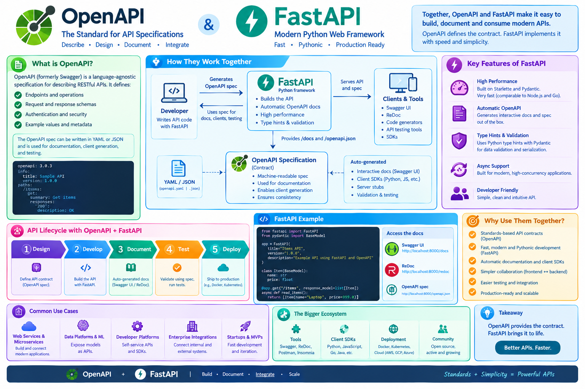

# REST Services Tutorial

Welcome to the comprehensive guide on REST Services. This tutorial is designed to take you from the basic concepts of Representational State Transfer to designing, implementing, and documenting professional-grade APIs.

1.  [**Introduction to REST**](./01-introduction.md)
    *   What is REST?
    *   REST vs. Traditional Web Services (SOAP)
    *   Why REST dominates the landscape.
2.  [**Core Building Blocks**](./02-core-concepts.md)
    *   Resources and URIs.
    *   HTTP Methods (GET, POST, PUT, PATCH, DELETE).
    *   Media Types and Status Codes.
3.  [**Designing a RESTful API**](./03-designing-apis.md)
    *   Resource Modeling.
    *   Choosing the Right HTTP Methods.
    *   Handling Errors and Status Codes.
4.  [**API Specifications & OpenAPI**](./04-specifications.md)
    *   The role of specifications.
    *   OpenAPI 3.0 (OAS).
    *   The Swagger Ecosystem.
5.  [**Practical Implementation**](./05-implementation.md)
    *   Building REST services with Python and Flask.
    *   Using Flask-RESTful.
    *   Implementing CRUD operations.
6.  [**REST Tooling**](./06-tooling.md)
    *   CLI Tools (`curl`, `HTTPie`).
    *   GUI Clients (Postman, Insomnia).
    *   Interactive Documentation (Swagger UI).
7.  [**Security & Best Practices**](./07-security-best-practices.md)
    *   Authentication (JWT, OAuth 2.0).
    *   Rate Limiting and CORS.
    *   API Versioning and Documentation.
8.  [**Exercises & Assignments**](./08-exercises.md)
    *   Practical challenges to test your knowledge.

## 📚 Appendix
- [**Modernizing with FastAPI**](./appendix-fastapi.md): Comparing FastAPI with Flask and OpenAPI-first approaches.

---
*This tutorial is part of the Cloudmesh AI Lecture series.*
