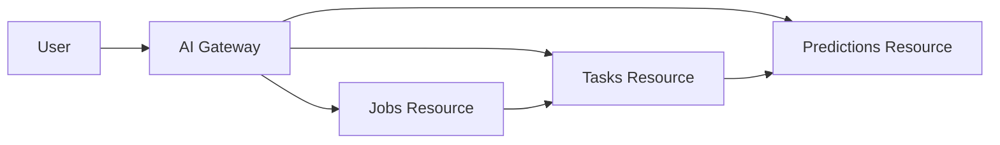

# REST AI Services Example {#sec:restai-kmeans}

!!! info "Learning Objectives"
    After completing this chapter, you will be able to:
    * Implement an AI routine using scikit-learn and expose it via REST services.
    * Use OpenAPI 3.0 specifications to define AI service endpoints.
    * Manage data uploads and model state using job IDs in a RESTful API.
    * Handle multipart/form-data for training and prediction files.

## The Problem: Bridging the Gap between ML and REST

In a typical Machine Learning (ML) workflow, the process is linear: you load data, fit a model, and then use that model to predict. However, translating this into a web service introduces three major challenges:

1. **State Persistence**: ML models are "stateful" objects. A trained scikit-learn model exists in memory. In a REST API, which is designed to be stateless, we must find a way to link a specific request (prediction) to a specific previously trained model.
2. **Data Volume**: Training data and prediction sets are often large CSV or binary files. Sending these inside a JSON body (via Base64 encoding) is inefficient, increases latency, and causes significant memory overhead.
3. **Computation Time**: Fitting a model can take seconds or even hours. Standard synchronous HTTP requests will timeout if the server takes too long to respond.

To solve these problems, we implement a **Job-based Architecture**. Instead of a single "do everything" endpoint, we break the process into discrete resources: **Jobs**, **Tasks**, and **Predictions**. This allows us to track state via IDs and handle large files using `multipart/form-data`.

## Overview

This chapter demonstrates a practical example of invoking a K-means Clustering routine in scikit-learn using an asynchronous RESTful architecture. Because AI model fitting can be computationally expensive and lead to HTTP timeouts, we implement a task-based pattern using **Jobs**, **Tasks**, and **Predictions**.

### Resource Hierarchy



### Detailed Route Descriptions

This architecture ensures that long-running computations do not block the API response.

#### 1. The Job Resource (`POST /jobs`)

The **Job** handles data ingestion.

* **What it does**: Uploads a dataset and maps it to a `job_id`.
* **Why this way**: Decouples data upload from computation.

#### 2. The Task Resource (`POST /jobs/{id}/tasks` and `GET /tasks/{tid}`)

The **Task** manages the asynchronous execution of the model fitting.

* **What it does**: `POST /jobs/{id}/tasks` triggers the fitting process and immediately returns a `task_id`. The client then polls `GET /tasks/{tid}` to check if the status is `completed` or `failed`.
* **Why this way**: Prevents HTTP timeouts. The server processes the model fitting in the background.

#### 3. The Prediction Resource (`POST /jobs/{id}/predictions`)

The **Prediction** applies the resulting model to new data.

* **What it does**: Once the associated task is complete, this endpoint uses the fitted model to generate cluster assignments for a new file.
* **Why this way**: Creates a new prediction result resource based on the specific model state.

The implemented REST routes are summarized in the following table:

| Route | Method | Input | Output | Description |
| --- | --- | --- | --- | --- |
| `/jobs` | `POST` | `multipart/form-data` (file) | `JSON` | Creates a new job and returns a `job_id`. |
| `/jobs/{id}/tasks` | `POST` | `JSON` (`model_params`) | `JSON` | Triggers background fitting and returns a `task_id`. |
| `/tasks/{tid}` | `GET` | None | `JSON` | Returns task status and result metadata. |
| `/jobs/{id}/predictions` | `POST` | `multipart/form-data` (file) | `text/csv` | Generates predictions using the fitted model. |

The workflow consists of the following steps:

* Uploading a file containing data points to create the k-means clustering model.
* Invoking the scikit-learn KMeans module asynchronously via tasks.
* Uploading a file with points for prediction and receiving the predicted cluster IDs.
* Exposing auxiliary routines as REST services.

The REST services are created using FastAPI, which provides native support for OpenAPI 3.0.

## Project Files

The example files are available in the [GitHub repository](https://github.com/cloudmesh-community/book/tree/master/examples/rest/kmeans?utm_source=gemini).

* OpenAPI 3 service definitions: [api.yaml](https://github.com/cloudmesh-community/book/blob/master/examples/rest/kmeans/api.yaml?utm_source=gemini)
* FastAPI server: [server.py](https://github.com/cloudmesh-community/book/blob/master/examples/rest/kmeans/server.py?utm_source=gemini)
* Kmeans service implementation: [kmeans.py](https://github.com/cloudmesh-community/book/blob/master/examples/rest/kmeans/kmeans.py?utm_source=gemini)
* Python requirements: [requirements.txt](https://github.com/cloudmesh-community/book/blob/master/examples/rest/kmeans/requirements.txt?utm_source=gemini)
* Example data: [model.csv](https://github.com/cloudmesh-community/book/blob/master/examples/rest/kmeans/model.csv?utm_source=gemini) and [predict.csv](https://github.com/cloudmesh-community/book/blob/master/examples/rest/kmeans/predict.csv?utm_source=gemini)

## Implementation

The following implementation provides a complete server including imports, global state, and the service logic for uploading data, fitting the model via background threads, and performing predictions.

```python
import os
import numpy as np
from sklearn.cluster import KMeans
from fastapi import FastAPI, UploadFile, File, Form, HTTPException
from fastapi.responses import FileResponse
from pydantic import BaseModel
from typing import Dict, Any

app = FastAPI()

# Global state
INPUT_DIR = "inputs"
OUTPUT_DIR = "outputs"
inputs: Dict[int, str] = {}
inputs_r: Dict[str, int] = {}
models: Dict[int, Any] = {}
tasks: Dict[str, Dict[str, Any]] = {}
default_model_params = {"n_clusters": 8, "max_iter": 300}

# Ensure directories exist
os.makedirs(INPUT_DIR, exist_ok=True)
os.makedirs(OUTPUT_DIR, exist_ok=True)

class FitRequest(BaseModel):
    job_id: int
    model_params: Dict[str, Any]

@app.post("/jobs")
async def create_job(file: UploadFile = File(...)):
    filename = file.filename
    in_file = os.path.join(INPUT_DIR, filename)
    
    if not os.path.exists(in_file):
        with open(in_file, "wb") as buffer:
            buffer.write(await file.read())

    if in_file not in inputs_r:
        job_id = len(inputs)
        inputs.update({job_id: in_file})
        inputs_r.update({in_file: job_id})
    else:
        job_id = inputs_r[in_file]

    return {"job_id": job_id, "filename": filename}

@app.post("/jobs/{job_id}/tasks")
def create_fit_task(job_id: int, body: FitRequest):
    if job_id not in inputs or not os.path.exists(inputs[job_id]):
        raise HTTPException(status_code=500, detail=f"input file missing for job id {job_id}")
    
    task_id = f"task_{len(tasks)}"
    tasks[task_id] = {"status": "processing", "job_id": job_id, "params": body.model_params}
    
    # Simulate background processing (In production, use Celery/Redis)
    def run_fit():
        in_file = inputs[job_id]
        X = np.genfromtxt(in_file, delimiter=",")
        params = dict(default_model_params)
        params.update(body.model_params)
        kmeans = KMeans(**params).fit(X)
        models.update({job_id: kmeans})
        labels_file = os.path.join(OUTPUT_DIR, f"{job_id}.labels")
        np.savetxt(labels_file, kmeans.labels_, delimiter=",")
        tasks[task_id]["status"] = "completed"
        tasks[task_id]["result_file"] = labels_file

    import threading
    threading.Thread(target=run_fit).start()

    return {"task_id": task_id, "status": "processing"}

@app.get("/tasks/{task_id}")
def get_task_status(task_id: str):
    if task_id not in tasks:
        raise HTTPException(status_code=404, detail="Task not found")
    return tasks[task_id]

@app.post("/jobs/{job_id}/predictions")
async def create_prediction(job_id: int, file: UploadFile = File(...)):
    if job_id in models:
        p_file = os.path.join(OUTPUT_DIR, f"{job_id}.p")
        with open(p_file, "wb") as buffer:
            buffer.write(await file.read())

        p = np.genfromtxt(p_file, delimiter=",")
        result = models[job_id].predict(p)

        res_file = os.path.join(OUTPUT_DIR, f"{job_id}.out")
        np.savetxt(res_file, result, delimiter=",")

        return FileResponse(res_file, media_type="text/csv")
    else:
        raise HTTPException(status_code=500, detail=f"model not found for job id {job_id}")

```

## Running the Example

Follow these steps to run the K-means REST service example:

1. Navigate to the example directory.
2. Activate your Python 3 virtual environment.
3. Install the required dependencies:

```bash
$ pip install -r requirements.txt

```

4. Start the server using uvicorn:

```bash
$ uvicorn server:app --reload --port 8000

```

5. Upload the training file:

```bash
$ curl -X POST "http://localhost:8000/jobs" \
    -H "accept: application/json" \
    -H "Content-Type: multipart/form-data" \
    -F "file=@model.csv;type=text/csv"

```

6. Trigger the fitting task:

```bash
$ curl -X POST "http://localhost:8000/jobs/0/tasks" \
    -H "accept: application/json" \
    -H "Content-Type: application/json" \
    -d "{\"job_id\":0,\"model_params\":{\"n_clusters\":3}}"

```

7. Poll task status:

```bash
$ curl -X GET "http://localhost:8000/tasks/task_0"

```

8. Perform predictions:

```bash
$ curl -X POST "http://localhost:8000/jobs/0/predictions" \
    -H "accept: text/csv" \
    -H "Content-Type: multipart/form-data" \
    -F "file=@predict.csv;type=text/csv"

```

The Swagger UI is interactively available at [http://localhost:8000/docs](http://localhost:8000/docs?utm_source=gemini).

## Service Endpoints

### Path /jobs

A POST request creates a new clustering job by uploading the required data file. The content type must be `multipart/form-data`.

Example input data (`model.csv` with 6 points in XY dimensions):

```text
1, 2
1, 4
1, 0
10, 2
10, 4
10, 0

```

Curl command:

```bash
$ curl -X POST "http://localhost:8000/jobs" \
        -H "accept: application/json" \
        -H "Content-Type: multipart/form-data" \
        -F "file=@model.csv;type=text/csv"

```

A successful request returns a JSON response containing the filename and the associated Job ID:

```json
{
  "filename": "model.csv",
  "job_id": 0
}

```

### Path /jobs/{id}/tasks

A POST request triggers the model fitting process asynchronously. It returns a `task_id` and an initial status instead of blocking execution.

Example request body:

```json
{
  "job_id": 0,
  "model_params": {
    "n_clusters": 3
  }
}

```

Curl command:

```bash
$ curl -X POST "http://localhost:8000/jobs/0/tasks" \
        -H "accept: application/json" \
        -H "Content-Type: application/json" \
        -d "{\"job_id\":0,\"model_params\":{\"n_clusters\":3}}"

```

Response JSON:

```json
{
  "task_id": "task_0",
  "status": "processing"
}

```

### Path /tasks/{tid}

A GET request retrieves the current execution status of a specific task.

Curl command:

```bash
$ curl -X GET "http://localhost:8000/tasks/task_0"

```

Response JSON once complete:

```json
{
  "job_id": 0,
  "params": {
    "n_clusters": 3
  },
  "result_file": "outputs/0.labels",
  "status": "completed"
}

```

### Path /jobs/{id}/predictions

A POST request applies the fitted model to a new dataset (`predict.csv`).

Example input data:

```text
0, 0
12, 3

```

Curl command:

```bash
$ curl -X POST "http://localhost:8000/jobs/0/predictions" \
        -H "accept: text/csv" \
        -H "Content-Type: multipart/form-data" \
        -F "file=@predict.csv;type=text/csv"

```

The response returns a CSV file containing predicted cluster labels for the provided points:

```text
1.000000000000000000e+00
0.000000000000000000e+00

```

## Implementation Notes

!!! warning "Asynchronous Processing & State"
AI jobs are often long-running. While the implementation uses Python threading for local demonstration, production setups should use robust task queues like Celery with Redis/RabbitMQ. Furthermore, global in-memory dictionaries will lose state on server restart; production scaling requires external model storage (such as object storage or a model registry).

## Summary Checklist

* [ ] Define OpenAPI 3.0 specifications for AI endpoints.
* [ ] Implement file upload handling using `multipart/form-data`.
* [ ] Create a mechanism to map Job IDs to model state and data.
* [ ] Integrate scikit-learn KMeans for fitting and prediction.
* [ ] Verify service endpoints using curl and Swagger UI.

## Assignments

!!! note "Assignment: Model Parameterization"
    Modify the fit task handler to accept additional scikit-learn KMeans parameters, such as `init` or `max_iter`, and verify that the model behaves as expected.

!!! note "Assignmet: Result Export"
    Create a new endpoint `/jobs/{id}/centers` that returns the cluster centers for a given Job ID in JSON format.

## Self-Evaluation

??? note "How does the Job ID facilitate the separation of the fit and predict services?"
The Job ID acts as a unique identifier that links the uploaded training data, the resulting fitted model stored in memory, and the subsequent prediction requests. This allows the server to remain stateless regarding the client session while maintaining state regarding the AI model.

??? note "Why is multipart/form-data used for the upload and predict endpoints instead of a JSON body?"
`multipart/form-data` is more efficient for transferring large binary or text files (like CSVs) compared to encoding file content as a base64 string within a JSON payload, which increases the data size and processing overhead.

??? note "What are the limitations of storing fitted models in an in-memory dictionary?"
In-memory storage is volatile; if the server restarts, all fitted models are lost. Additionally, this approach does not scale across multiple server instances (load balancing), as the model would only exist on the instance that performed the fitting. A distributed cache or database would be required for production scalability.

***

Would you like to explore adding a persistent database or production task runner layout (like Celery) to this setup?

```