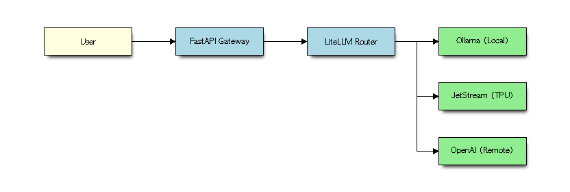
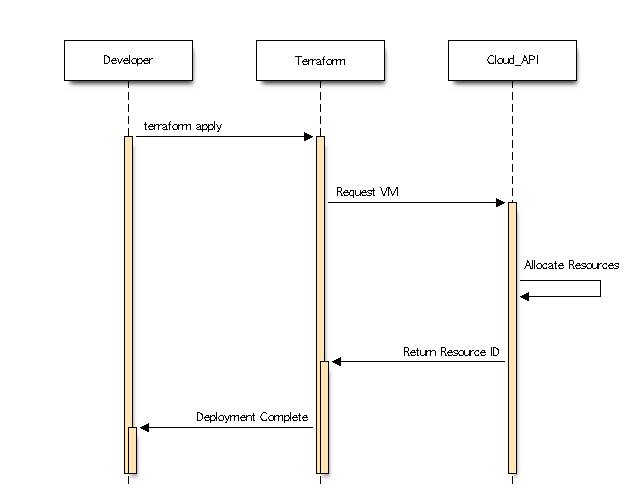
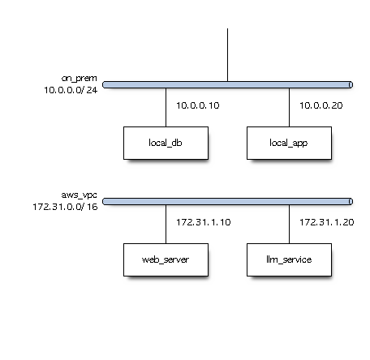
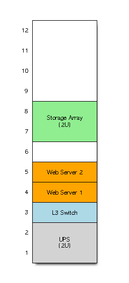

# Blockdiag

!!! info "Learning Objectives"
    - Understand the blockdiag family of tools.
    - Create block diagrams, sequence diagrams, and state machines.
    - Apply structural visualization to Cloud, DevOps, and AI architectures.

## Overview

`blockdiag` is a family of tools that allow you to define diagrams using a simple, Python-like text language. Unlike Graphviz, which focuses on general graphs, the blockdiag suite is specifically designed for structural diagrams where "blocks" represent components and "arrows" represent flows or dependencies.

The suite includes:
- **blockdiag**: For basic block diagrams (component flow).
- **seqdiag**: For sequence diagrams (interaction over time).
- **nwdiag**: For network diagrams (grouping components in networks).
- **statediag**: For state transition diagrams (lifecycle/logic).
- **rackdiag**: For server rack layouts (physical data center equipment).

## Installation

Blockdiag is written in Python. To avoid dependency conflicts and environment issues, it is highly recommended to use a virtual environment with Python 3.12 and a specific version of Pillow to avoid compatibility issues with `getsize`:

```bash
python3.12 -m venv .venv
source .venv/bin/activate
pip install blockdiag seqdiag nwdiag actdiag "Pillow<10.0.0" "setuptools<70.0.0"
```

Installing with these specific versions ensures that required legacy modules like `pkg_resources` and `Pillow.ImageDraw.getsize` are handled correctly.

## Diagram Types & Examples

### 1. Block Diagrams (`blockdiag`)
Best for high-level architecture and data flow.

**Example: AI LLM Request Pipeline**
This diagram shows how a user request is processed by an AI Gateway before reaching the model.

```blockdiag
blockdiag {
    orientation = landscape
    
    User [color=lightyellow];
    API_Gateway [label = "FastAPI Gateway", color=lightblue];
    LiteLLM_Router [label = "LiteLLM Router", color=lightblue];
    
    Ollama [label = "Ollama (Local)", color=lightgreen];
    JetStream [label = "JetStream (TPU)", color=lightgreen];
    OpenAI [label = "OpenAI (Remote)", color=lightgreen];
    
    User -> API_Gateway;
    API_Gateway -> LiteLLM_Router;
    LiteLLM_Router -> Ollama;
    LiteLLM_Router -> JetStream;
    LiteLLM_Router -> OpenAI;
}
```



### 2. Sequence Diagrams (`seqdiag`)
Best for visualizing the temporal order of messages between components.

**Example: Cloud Resource Provisioning Flow**
Visualizing the interaction between a developer, Terraform, and a Cloud Provider.

```seqdiag
seqdiag {
    Developer -> Terraform [label = "terraform apply"];
    Terraform -> Cloud_API [label = "Request VM"];
    Cloud_API -> Cloud_API [label = "Allocate Resources"];
    Cloud_API -> Terraform [label = "Return Resource ID"];
    Terraform -> Developer [label = "Deployment Complete"];
}
```



### 3. Network Diagrams (`nwdiag`)
Best for depicting network topology and groupings (subnets/VPCs).

**Example: Hybrid Cloud Connectivity**
Showing an on-premise data center connected to a VPC.

```nwdiag
nwdiag {
    network on_prem {
        address = "10.0.0.0/24";
        local_db [address = "10.0.0.10"];
        local_app [address = "10.0.0.20"];
    }
    
    network aws_vpc {
        address = "172.31.0.0/16";
        web_server [address = "172.31.1.10"];
        llm_service [address = "172.31.1.20"];
    }
    
    local_app -> web_server [label = "VPN Tunnel"];
    web_server -> llm_service [label = "Internal API"];
}
```



### 4. State Diagrams (`statediag`)
Although blockdiag has a statediagto visualize the lifecycle of a resource or the logic of an agent. It has been found to be rather unreliable and tools such as graphviz and mermaid are to be preferred.

For this reason no example and image is provided here.

### 5. Rack Diagrams (`rackdiag`)
`rackdiag` is a diagram-as-code tool used to generate visual layouts of server rack enclosures, data center equipment, switches, routers, and patch panels. It is part of the broader nwdiag and blockdiag family of Python utilities. Instead of dragging and dropping items in a graphical app, you define the physical height of the rack (in Rack Units, or U) and place your hardware line by line using simple text syntax.

**Example: Server Rack Layout**
```rackdiag
rackdiag {
  // Define rack height
  12U;

  // Map devices to specific rack units (RU)
  1: UPS [2U, color = lightgrey];
  3: L3 Switch [color = lightblue];
  4: Web Server 1 [color = orange];
  5: Web Server 2 [color = orange];
  7: Storage Array [2U, color = lightgreen];
}
```



**Key Features:**
- **Text-Based Architecture**: Easy to version control (like Git) alongside your project documentation.
- **Automatic Scaling**: Automatically calculates device heights (e.g., [2U]) and positions them cleanly inside the cabinet slot numbers.
- **Customization**: Allows color-coding, descriptions, and labels for quick visual inventory management.

## Summary Table

| Tool | Best Use Case | Key Concept |
| --- | --- | --- |
| `blockdiag` | Architecture / Flow | Blocks and Arrows |
| `seqdiag` | Interaction / Protocol | Lifelines and Messages |
| `nwdiag` | Topology / Infrastructure | Networks and IP addresses |
| `statediag` | Logic / Lifecycle | States and Transitions |
| `rackdiag` | Physical Layout | Racks and Units (U) |

## Assignments

!!! note "Assignment"
    Choose one of the following and implement it using the blockdiag suite:
    1. Create a `seqdiag` diagram illustrating the OAuth2 authentication flow for a Cloud AI service.
    2. Create a `nwdiag` diagram of a multi-region deployment with a load balancer and database replicas.
    3. Create a `statediag` diagram showing the lifecycle of a Kubernetes Pod (Pending $\rightarrow$ Running $\rightarrow$ Succeeded/Failed).
