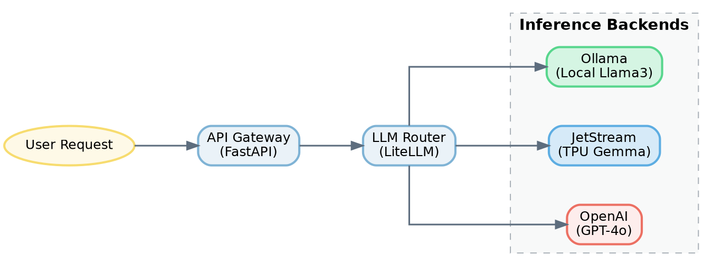
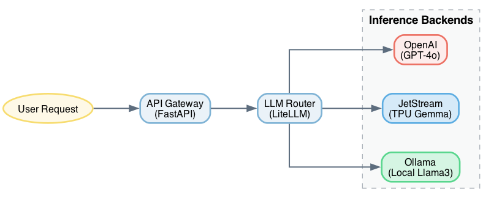
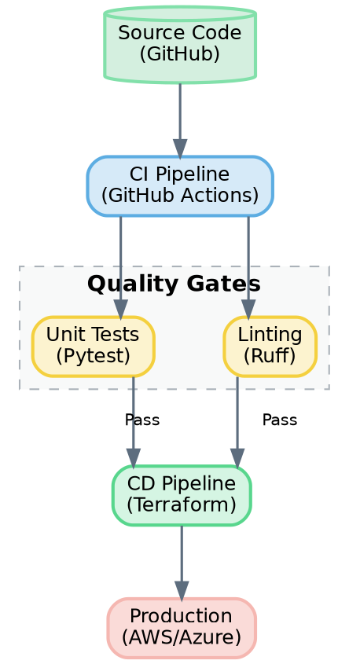
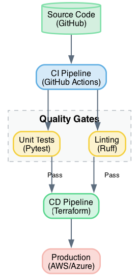

# Graphviz

!!! info "Learning Objectives"
    - Install Graphviz and optional GUI tools.
    - Create diagrams using the DOT language.
    - Render DOT files into various image formats.

## Overview

Graphviz is a tool for visualizing structural information through abstract graphs and networks. It uses automatic layout algorithms to arrange nodes and edges, allowing the user to focus on defining dependencies rather than manual positioning.

The official project resources are available at:
- <https://graphviz.gitlab.io/resources/>

## Installation

### macOS Installation

Install Graphviz using Homebrew:

```bash
brew install graphviz
```

A GUI version is available at:
- <http://www.pixelglow.com/graphviz/>
- Download: <http://www.pixelglow.com/downloads/graphviz-1.13-v16.dmg>

The community-distributed DotEditor can be installed via Homebrew:

```bash
brew cask install doteditor
```

Alternatively, DotEditor can be downloaded from:
- <https://vincenthee.github.io/DotEditor/>

### Online Tools

Several web-based implementations of Graphviz are available:
- <http://www.webgraphviz.com/>
- <https://dreampuf.github.io/GraphvizOnline/>
- <http://viz-js.com/>
- <http://graphviz.it/#/gallery/unix.gv>

## Usage

### Rendering Graphs

Create a `.dot` file and execute the `dot` command to render the graph.

To generate a PNG file:

```bash
dot -Tpng filename.dot -o filename.png
```

To generate SVG or PDF files:

```bash
dot -Tsvg filename.dot -o filename.svg
dot -TPDF filename.dot -o filename.pdf
```

For LaTeX documents, PDF output is recommended due to higher quality and smaller file size compared to PNG.

### The DOT Format

Detailed documentation is available at:
- <https://graphviz.gitlab.io/documentation/>

Here are a few examples of how to define and render graphs related to AI and DevOps.

#### Example 1: AI LLM Routing Pipeline
This example shows a request flowing from a user through a gateway and router to various LLM backends.





#### Example 2: DevOps CI/CD Pipeline
This example visualizes a typical software delivery pipeline.





Example of a minimal "Hello World" graph:

```bash
echo "digraph G {}" | dot -Tpng > hello.png
```

## Summary Checklist

- [ ] Graphviz installed and verified.
- [ ] Successfully rendered a `.dot` file to PNG.
- [ ] Successfully rendered a `.dot` file to PDF or SVG.
- [ ] Verified the DOT syntax for a basic directed graph.

## Assignments

!!! note "Assignment 1"
    Develop a REST service that accepts a graph description as input and returns a rendered version of the graph in a format specified by a request parameter.

!!! note "Assignment 2"
    Develop a REST service that accepts a graph as input, renders it, and stores the result on a remote data server (another REST service). The service should return the URL of the stored image.

!!! note "Assignment 3"
    Develop a REST service that accepts a graph as input and stores the rendered output on a cloud storage provider (e.g., Box or Google Drive). Ensure that authentication credentials and access keys are not exposed in the source code.

## Self-Evaluation

??? note "What is the primary advantage of using Graphviz over manual drawing tools?"
    Graphviz uses automatic layout algorithms, which means the user defines the relationships (edges) between elements (nodes) and the tool determines the optimal visual positioning.

??? note "Which output format is preferred for LaTeX documents and why?"
    PDF is preferred because it provides vector-based quality and typically results in smaller file sizes than raster formats like PNG.

??? note "How do you specify the output format in the `dot` command?"
    The output format is specified using the `-T` flag (e.g., `-Tpng`, `-Tsvg`, `-TPDF`).

## References

- Graphviz Official Site: <https://graphviz.gitlab.io/>
- DOT Language Documentation: <https://graphviz.gitlab.io/documentation/>
