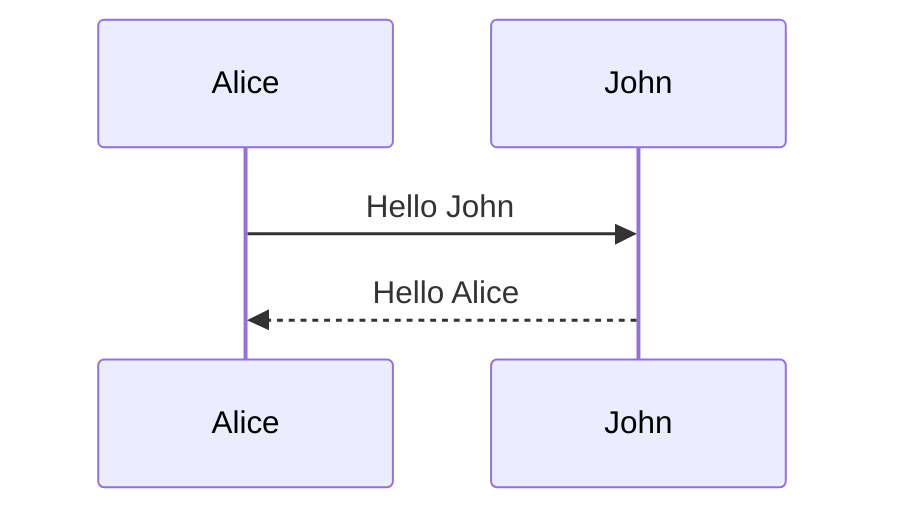

# Markdown

!!! info "Learning Objectives"
    After completing this chapter, you will be able to:
    * Use basic Markdown syntax for structured technical documentation.
    * Apply consistent formatting rules for headings, lists, and code blocks.
    * Convert Markdown documents using Pandoc.
    * Integrate BibTeX citations and manage bibliographies.
    * Create diagrams using Mermaid.
    * Validate Markdown syntax for academic and technical submissions.

## Overview

Markdown is a markup language used to develop clean, structured documents. Unlike WYSIWYG editors, Markdown emphasizes document structure over visual layout. Proper use of headings and structural elements ensures that the document is logically organized and portable across different rendering engines.

## Markdown Format

### Quick Reference

| Element | Syntax | Result |
| :--- | :--- | :--- |
| Heading 1 | `# Text` | Largest Heading |
| Heading 2 | `## Text` | Section Heading |
| Heading 3 | `### Text` | Subsection Heading |
| Bold | `**Text**` | **Bold Text** |
| Italic | `*Text*` | *Italic Text* |
| Monospace | `` `Text` `` | `Code/Monospace` |
| Link | `[Text](URL)` | [Clickable Link] |
| Image | `` | Embedded Image |
| Quote | `> Text` | Blockquote |
| List | `* Item` | Bullet Point |

### Basic Syntax

To create headings, use the hash symbol:

```markdown
# Heading 1
## Heading 2
### Heading 3
```

Paragraphs are separated by a blank line. A blank line must always follow a heading.

**Text attributes:**

```markdown
*italic*
**bold**
`monospace`
```

**Horizontal rule:**

```markdown
---
```

**Bullet list:**

```markdown
* Item 1
* Item 2
* Item 3
```

**Numbered list:**

```markdown
1. First
2. Second
3. Third
```

**Links:**

```markdown
[Example Link](http://example.com)
```

**URLs:**

```markdown
[Google](http://www.google.com)
or
<http://www.google.com>
```

**Images:**

Images must be stored locally and must not use HTTP references. All images must be placed in a directory called `images/`.

```markdown

```

Any figure used in the text must be referred to with a figure caption and label. Images cannot be embedded in itemized lists.

**Quotes:**

Quotes are indicated by placing a `>` in front of each quoted line. The source must be clearly indicated before or after the quote:

```markdown
> "This is a quote" [@label].
```

The period follows the citation label. Alternatively, a quote can be introduced as follows:

```markdown
In [@label], we find the following list of properties:
> * Property 1
> * Property 2
```

In the case of lists, additional quotation marks are avoided to prevent confusion; the `>` symbol indicates the quoted text.

### Common Errors to Avoid

* Missing empty lines before and after sections.
* Using `-` or `=` for section underlines instead of `#`.
* Using incorrect numbers of `#` for headings.
* Using `#` to simulate bold text.
* Missing empty lines before and after code block boundaries.
* Not left-indenting text in code blocks.
* Not ending code blocks properly.
* Using incorrect spacing in lists.
* Not using a spell checker.
* Having spaces in front of numbered list items.
* Not using 80-character block formatting.

## Editors

Several tools support Markdown writing. Focus on structure guides rather than visual output, as most editors do not render Markdown in real-time.

Recommended editors:

* **Emacs**: A universal editor with Markdown support. For macOS, Aquamacs and CarbonEmacs are options.
* **PyCharm**: Includes a Markdown editing mode for Python development.
* **Visual Studio Code**: An editor from Microsoft with Markdown support and extensions. Available at <https://code.visualstudio.com/>.

## Conversion

To convert Markdown to other formats, use `pandoc`.

Converted documents may require manual cleanup of text, character encoding, and spacing to meet project requirements. Pandoc supports conversion between Markdown and various formats, including ePub, PDF, and HTML.

!!! warning "Pandoc and MS Word"
    While Pandoc can convert from MS Word (`.docx`), Word character sets often introduce noise that requires manual cleanup. Writing directly in Markdown is generally more efficient.

### Conversion with Pandoc

Pandoc is a tool for converting file formats. It supports Markdown, reStructuredText, textile, HTML, DocBook, LaTeX, MediaWiki, TWiki, TikiWiki, Creole 1.0, Vimwiki, OPML, Emacs Org-Mode, Emacs Muse, txt2tags, Microsoft Word docx, LibreOffice ODT, ePub, and Haddock markup.

Website: <https://pandoc.org/>

To convert a file, use the `-o` option to specify the output file:

```bash
pandoc filename.md -o filename.tex
```

### Pandoc Cheat Sheet

| Flag | Description | Example |
| :--- | :--- | :--- |
| `-o` | Specify output file | `-o output.pdf` |
| `-f` | Specify input format | `-f markdown` |
| `-t` | Specify output format | `-t latex` |
| `--filter` | Apply a Pandoc filter | `--filter pandoc-crossref` |
| `--verbose` | Show detailed output | `--verbose` |
| `--standalone` | Create a full document | `--standalone` |

### Advanced Pandoc

Pandoc supports extensions and filters. Available packages include:

* **Include files**: <http://pandoc.org/filters.html#include-files>
* **Integration of R**: <https://github.com/cdupont/r-pandoc>
* **Figure numbers**: <https://github.com/tomduck/pandoc-fignos>
* **Equation numbers**: <https://github.com/tomduck/pandoc-eqnos>
* **Table numbers**: <https://github.com/tomduck/pandoc-tablenos>
* **Cross-references**: <https://github.com/lierdakil/pandoc-crossref>
* **Section numbering**: <https://github.com/chdemko/pandoc-numbering>
* **CSV tables**: <https://github.com/baig/pandoc-csv2table>
* **Inline CSV tables**: <https://github.com/mb21/pandoc-placetable>

The current framework utilizes `crossref` and `crosscite`.

### Mermaid

Mermaid allows the creation of diagrams and graphs using a description language. It supports flowcharts, sequence diagrams, Gantt charts, and UML-like diagrams.

* **Live Editor**: [Mermaid Live Editor](https://mermaidjs.github.io/mermaid-live-editor/)
* **Pandoc Plugin**: [mermaid-filter](https://github.com/raghur/mermaid-filter)

**Installation:**

```bash
npm install --global mermaid-filter
```

**Sequence Diagram Example:**



**Flowchart Example:**


## Presentations in Markdown

The following resources describe using Markdown for presentation slides:

* [Marp](https://yhatt.github.io/marp/)
* [Slidify](http://slidify.org/)
* [R Markdown Lesson 11](https://rmarkdown.rstudio.com/lesson-11.html)
* [GitPitch Slide Markdown](https://github.com/gitpitch/gitpitch/wiki/Slide-Markdown)

### Markdown to PPTX

Pandoc exports Markdown directly to PowerPoint (`.pptx`).

```bash
pandoc filename.md -o filename.pptx
```

This creates a basic presentation that can be refined using PowerPoint's "Outline View".

## Validating Markdown

Since Markdown is a simple format, validation is generally straightforward. Manual inspection is recommended, along with local compilation to ePub.

For automated linting, use:

* [remark-lint](https://github.com/remarkjs/remark-lint)

!!! note "remark-lint Warning"
    Copy files to a separate directory before running `remark-lint` to avoid installing dependencies in the project root.

## Writing Papers and Reports with Markdown

### Proper Use of `<>`

Avoid using "greater than" (`>`) and "less than" (`<`) characters without quoting when referring to command-line parameters or keys. Use backticks to prevent interpretation as raw HTML:

```markdown
`<key>` or `command <parameter>`
```

### URLs in Markdown

URLs must use proper Markdown syntax:

```markdown
[text](url)
or
<url>
```

### Use Asterisks instead of Underscores

Use asterisks (`*`) for emphasis to avoid issues during translation and conversion:

```markdown
*italic*
**bold**
```

### Hyperreferences to Other Sections

Ensure the link target is correct and contains no spaces:

```markdown
# This is my header
...
[Section](#this-is-my-header)
```

### Code in Markdown

Use fenced code blocks with language tags for syntax highlighting.

**Example Python block:**

```python
# Example Python code
print("Hello World")
```

**Example Bash block:**

```bash
$ ls -la
$ echo "Hello World"
```

#### Documenting Code Blocks

To display the raw syntax of a code block without rendering, wrap it in a larger fence using more backticks than the inner block, or use tildes (`~~~`).

**Example using tildes:**

~~~markdown
```python
print("This will be shown as raw text")
```
~~~


!!! note "Spacing Reminder"
    Ensure there is an empty line both before and after every code block.

### Citations in Markdown

Reuse references from other contributors to avoid duplication. Fix errors in shared references in both the local `.bib` file and the source file. Use consistent labels for cross-referencing.

Use **JabRef** or **Emacs** to manage bibliographies. Incorrect bibliography syntax may lead to point deductions.

**File Naming Conventions:**

* **Papers**: Use `paper.md` and `paper.bib`.
* **Reports**: Use `report.md` and `report.bib`.
* **Images**: Store all images in an `images/` directory.

To cite a reference, use the `[@label]` syntax:

```markdown
Google [@www-google] is a company that offers cloud services.
```

**Example BibTeX entry:**

```bibtex
@Misc{www-google,
    author = {{Google}},
    title = {Google Search},
    howpublished = {\url{https://www.google.com}},
    year = {2023}
}
```

### Markdown and BibTeX

A centralized build process generates proceedings from Markdown and BibTeX. Regular review of generated ePubs is recommended.

For guidance on BibTeX entries, refer to:
<https://github.com/cloudmesh-community/book/blob/master/README.md>

Additional resource:
http://cyberaide.org/papers/vonLaszewski-latex.pdf

#### Using BibTeX in MkDocs

The `mkdocs-bibtex` plugin processes Pandoc-style citations and generates bibliographies automatically.

**Prerequisites**

Pandoc must be installed on the operating system.

**Setup Instructions**

1. **Install the Plugin**

```bash
pip install mkdocs-bibtex
```

2. **Configure `mkdocs.yml`**

```yaml
plugins:
  - search
  - bibtex:
      bib_file: "refs.bib"
      cite_style: "pandoc"
```

3. **Use Citations in Markdown**

* Standard citation: `[@cite_key]`
* Multiple citations: `[@first_cite; @second_cite]`
* Inline citation: `@cite_key`

4. **Render the Bibliography**

To manually place the reference list:

```text
\bibliography
```

!!! note "Formatting Reminder"
    Include an empty line before and after headings, quotes, lists, and paragraphs. Do not indent paragraphs with tabs or spaces.

### BibTeX Validation

Use Emacs or JabRef to ensure correct placement of commas and brackets. Use `biber` for command-line validation.

Ensure that:

1. Labels contain no spaces.
2. Entry types are correct.
3. Company authors are enclosed in double brackets (e.g., `author = {{Google}}`).

### Using Pandoc for Local Validation

Verify documents locally using the following command for a directory containing `report.md`, `report.bib`, and `images/test.png`:

```bash
pandoc --verbose --filter pandoc-crossref -f markdown+header_attributes -f markdown+smart -f markdown+emoji --indented-code-classes=bash,python,yaml -o paper.epub paper.md
```

**Samples for reference:**

* [Sample Project Report](https://github.com/cloudmesh-community/proceedings-fa18/tree/master/project-report)
* [Sample 2-Page Paper](https://github.com/cloudmesh-community/proceedings-fa18/tree/master/paper)

## Summary Checklist

Before submitting work, verify the following:

- [ ] **File Naming**: Markdown file is `paper.md` or `report.md`; bibliography is `paper.bib` or `report.bib`.
- [ ] **Images**: All images are stored locally in an `images/` directory.
- [ ] **Syntax**: Asterisks (`*`) are used for italics and bold instead of underscores (`_`).
- [ ] **Structure**: Empty lines exist before and after every heading, quote, list, and code block.
- [ ] **Citations**: All technology references are cited; citation keys contain no spaces or underscores.
- [ ] **Validation**: Document is compiled locally (e.g., using Pandoc) to check for rendering errors.

## Assignments

!!! note "Assignment 1: Technical Report"
    Create a technical report using `report.md` and `report.bib`.

!!! note "Assignment 2: Citations"
    Include at least three citations using the `[@label]` syntax.

!!! note "Assignment 3: Visuals"
    Embed at least one image from the `images/` directory and one Mermaid diagram.

!!! note "Assignment 4: Validation"
    Validate the output by converting the report to ePub using Pandoc.

## Self-Evaluation

??? note "What is the correct way to create a heading in Markdown for this project?"
    Use the hash symbol (`#`) followed by a space. Do not use underscores or equal signs for underlines.

??? note "Where should images be stored and how should they be referenced?"
    Images must be stored locally in an `images/` directory. They should be referenced using the syntax ``.

??? note "Which character should be used for bold and italic text to ensure compatibility?"
    Asterisks (`*` or `**`) should be used instead of underscores.

??? note "How do you cite a source in Markdown when using BibTeX?"
    Use the `[@label]` syntax, where `label` corresponds to the key defined in the `.bib` file.

??? note "What is the purpose of Pandoc in the Markdown workflow?"
    Pandoc is used to convert Markdown files into other formats such as PDF, ePub, or LaTeX, and to validate the document structure.

## References

* [Wikipedia: Markdown](https://en.wikipedia.org/wiki/Markdown)
