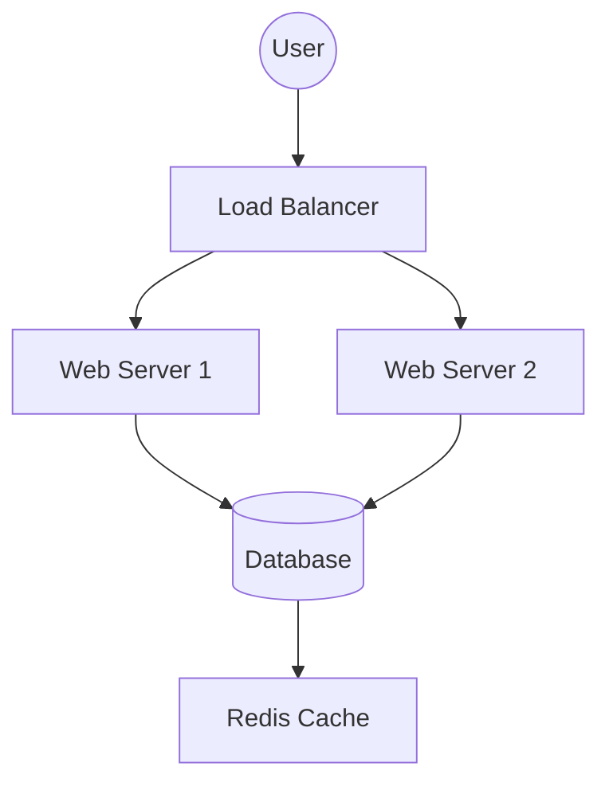
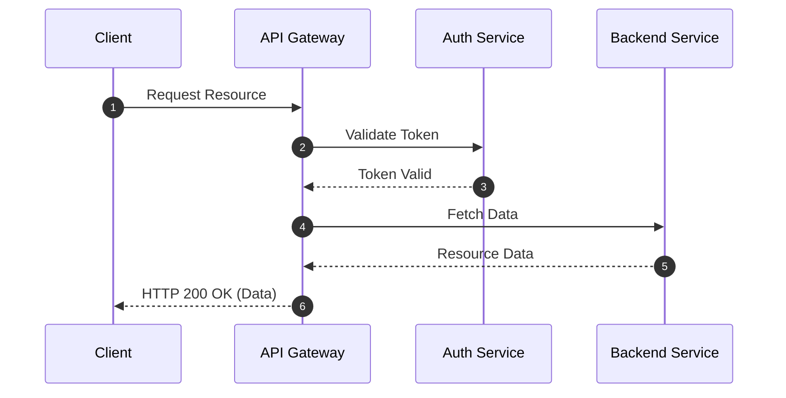
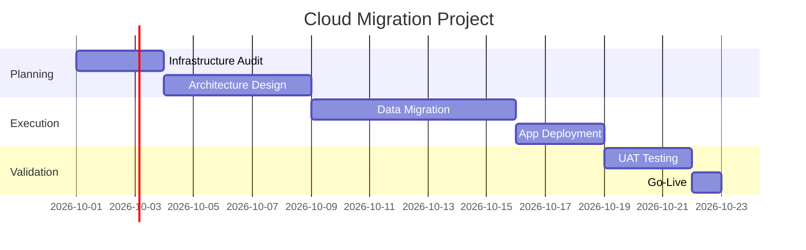

# Mermaid.js

Mermaid is a JavaScript-based charting and diagramming tool that renders Markdown-inspired text definitions to create and modify diagrams dynamically.

## Why use Mermaid?

- **Version Control**: Diagrams are stored as text, making them easy to track in Git.
- **Consistency**: Standardized styles across all diagrams.
- **Efficiency**: No need to use external drawing tools and export images.

## Common Diagram Types

### Flowcharts
Flowcharts are useful for representing infrastructure workflows and request routing, as shown in Figure 1.


Figure 1: Infrastructure request routing flow

### Sequence Diagrams
Sequence diagrams show how microservices interact in a cloud environment (see Figure 2).


Figure 2: Microservices interaction for resource request

### Gantt Charts
Gantt charts are ideal for tracking cloud migration or deployment phases, as illustrated in Figure 3.


Figure 3: Cloud migration project timeline

## Integration

Mermaid is natively supported by GitHub, GitLab, and many Markdown editors (like Obsidian or VS Code with extensions).

## Using Mermaid in MkDocs

To use Mermaid diagrams in an MkDocs site, follow these steps:

1. **Install `pymdown-extensions`**:
   Ensure you have `pymdown-extensions` installed in your environment:
   ```bash
   pip install pymdown-extensions
   ```

2. **Update `mkdocs.yml`**:
   Enable the `superfences` extension in your configuration:
   ```yaml
   markdown_extensions:
     - pymdownx.superfences:
         custom_fences:
           - name: mermaid
             class: mermaid
             format: !!python/name:pymdownx.superfences.fence_code_format
   ```

3. **Add the Mermaid JS Library**:
   Include the Mermaid JS script in your `mkdocs.yml` under `extra_javascript`:
   ```yaml
   extra_javascript:
     - https://unpkg.com/mermaid/dist/mermaid.min.js
   ```

4. **Initialize Mermaid**:
   You may need a small snippet of JavaScript to initialize the diagrams on the page. This can be added to a custom JS file:
   ```javascript
   mermaid.initialize({ startOnLoad: true });
   ```
