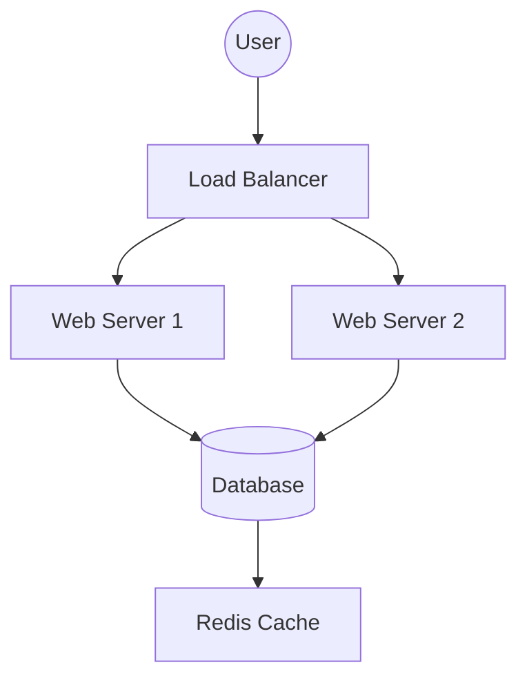
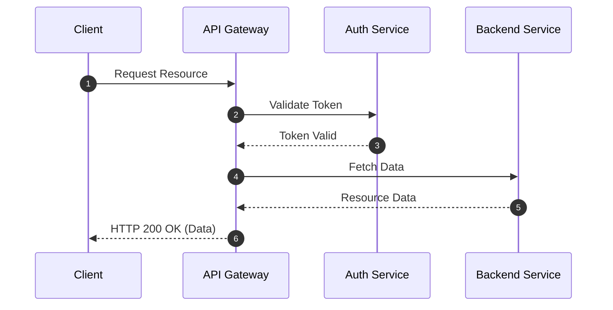
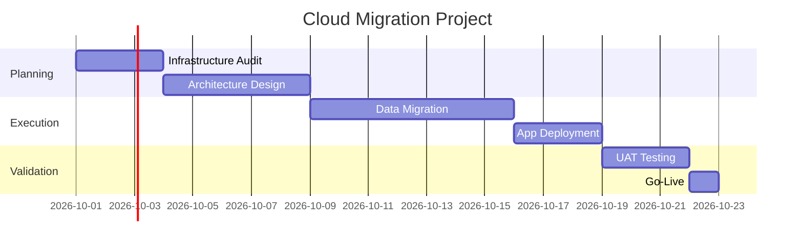

# Mermaid.js

!!! info "Learning Objectives"
    After completing this chapter, you will be able to:
    - Define Mermaid.js and its utility in technical documentation.
    - Create flowcharts, sequence diagrams, and Gantt charts using Mermaid syntax.
    - Integrate Mermaid.js into an MkDocs environment.

## Overview

Mermaid is a JavaScript-based charting and diagramming tool that renders Markdown-inspired text definitions to create and modify diagrams dynamically.

## Core Diagram Types

### Flowcharts

Flowcharts represent infrastructure workflows and request routing.

~~~

~~~


### Sequence Diagrams

Sequence diagrams illustrate how microservices interact within a cloud environment.

~~~

~~~


### Gantt Charts

Gantt charts track project timelines, such as cloud migration or deployment phases.

~~~

~~~


## Integration and Configuration

Mermaid is supported by GitHub, GitLab, and various Markdown editors.

### MkDocs Configuration

To implement Mermaid diagrams in an MkDocs site, perform the following steps:

1. Install `pymdown-extensions`:

```bash
pip install pymdown-extensions
```

2. Update `mkdocs.yml` to enable the `superfences` extension:

```yaml
markdown_extensions:
  - pymdownx.superfences:
      custom_fences:
        - name: mermaid
          class: mermaid
          format: !!python/name:pymdownx.superfences.fence_code_format
```

3. Add the Mermaid JS library to `mkdocs.yml`:

```yaml
extra_javascript:
  - https://unpkg.com/mermaid/dist/mermaid.min.js
```

4. Initialize Mermaid via a custom JavaScript file:

```javascript
mermaid.initialize({ startOnLoad: true });
```

## Summary Checklist

- [ ] Define the purpose of Mermaid.js.
- [ ] Create a flowchart using `graph TD`.
- [ ] Create a sequence diagram using `sequenceDiagram`.
- [ ] Create a Gantt chart using `gantt`.
- [ ] Configure `mkdocs.yml` for Mermaid support.

## Assignments

!!! note "Assignment 1: Architecture Mapping"
    Create a Mermaid flowchart that represents a three-tier architecture: a Client, an Application Load Balancer, an Auto Scaling Group of EC2 instances, and an RDS Database.

!!! note "Assignment 2: Authentication Flow"
    Create a sequence diagram showing the OAuth2 Authorization Code flow between a User, a Client Application, an Authorization Server, and a Resource Server.

## Self-Evaluation

??? note "What is the primary advantage of using Mermaid over static image files for diagrams?"
    Diagrams are stored as text, allowing them to be managed via version control systems like Git, facilitating easier updates and tracking.

??? note "Which MkDocs extension is required to render custom Mermaid fences?"
    The `pymdownx.superfences` extension is required.

??? note "How is a database represented in a Mermaid flowchart?"
    Databases are typically represented using the `[(Database)]` cylinder shape syntax.
