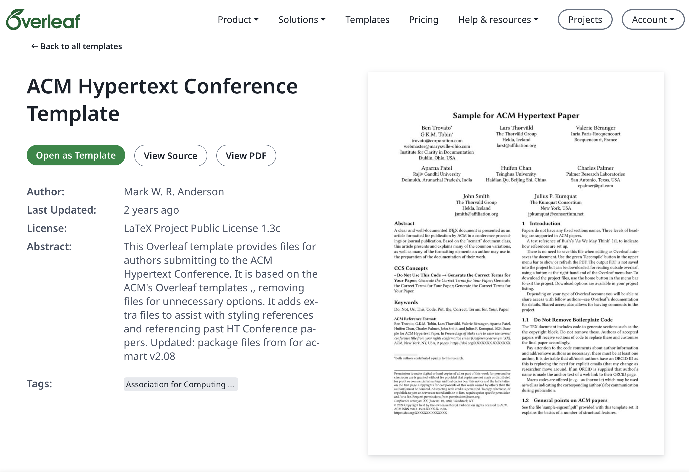

# Professional Scientific Writing with Overleaf

!!! info "Learning Objectives"
    * Understand the role of Overleaf in the scientific writing ecosystem.
    * Set up a collaborative LaTeX project using official ACM templates.
    * Manage bibliographies and citations using integrated BibTeX support.
    * Implement a collaborative workflow for co-authoring research papers.
    * Compare the direct LaTeX approach of Overleaf with the Markdown-to-PDF workflow.

## Overview

While Markdown-to-PDF workflows offer speed and simplicity, many scientific journals and conferences—including the ACM—provide official LaTeX templates that are the "gold standard" for final submissions. Overleaf is a cloud-based LaTeX editor that removes the need for local installation, providing a real-time collaborative environment similar to Google Docs but for professional typesetting.

## Core Sections

### 1. Introduction to Overleaf

Overleaf is a collaborative, cloud-based LaTeX editor. It eliminates the "LaTeX installation headache" by providing a pre-configured environment with the most common packages and distributions (like TeX Live) already installed.

#### Key Advantages
* **Zero Installation**: No need to manage local TeX distributions, which can be several gigabytes in size.
* **Real-time Collaboration**: Multiple authors can edit the same document simultaneously with a live preview.
* **Template Library**: Direct access to official templates from publishers like ACM, IEEE, and Nature.
* **Integrated Compilation**: Compiles documents on the cloud, reducing the load on the local machine.

### 2. Setting Up an ACM Project

To start a paper using the official ACM style in Overleaf, it is best to leverage the **Overleaf Template Gallery**.

#### Using the Template Gallery
The Template Gallery is a comprehensive repository of professionally designed LaTeX layouts. Instead of starting from a blank file, you can browse specific categories such as "Journal Articles," "Conference Papers," "Theses," or "CVs." 

To use a template:
1. Navigate to the [Overleaf Template Gallery](https://www.overleaf.com/latex/templates).
2. Search for "ACM" or browse the "Academic Journal" category.
3. Select the desired template (e.g., the official `acmart` layout) and click **"Open as Template."** This automatically creates a new project in your account with all the necessary `.cls` and `.tex` files pre-configured.

#### Project Structure
A typical Overleaf project created from a template contains:
* `main.tex`: The primary LaTeX source file.
* `references.bib`: The bibliography database.
* `figures/`: A folder for images and diagrams.
* `acmart.cls`: The class file defining the ACM layout.

#### Importing and Exporting Files
Overleaf provides several options for moving data in and out of the cloud environment:

*   **Importing**: Beyond using templates, you can import projects as `.zip` archives or sync directly with GitHub. Pandoc is used internally to import `.docx` and `.md` files, though visual styling may not be fully preserved.
*   **Exporting**: You can download your project as a source `.zip` for local backup or as a final PDF. Overleaf also allows exporting the content to `.docx`, `.md`, or `.html` formats.
*   **Technical Note**: Ensure your project compiles without errors before attempting an export, as unresolved LaTeX errors can cause the conversion process to fail.

### 3. Managing Citations and Bibliographies

Overleaf integrates seamlessly with BibTeX. To manage citations:

1. **Upload the `.bib` file**: Upload your bibliography database to the project root.
2. **Cite in Text**: Use the `\cite{key}` command to insert a citation.
3. **Define the Style**: Ensure the preamble contains `\bibliographystyle{ACM-Reference-Format}` and the end of the document has `\bibliography{references}`.
4. **Automatic Updates**: Every time the document is compiled, Overleaf updates the references list based on the citations actually used in the text.

### 4. Collaboration and Version Control

Overleaf provides a "Review" mode and "Chat" functionality to facilitate co-authoring.

* **Sharing**: Invite co-authors via email or a shareable link.
* **Track Changes**: Enable "Track Changes" to see exactly what was modified by which author.
* **Comments**: Highlight text to leave comments or suggestions without altering the manuscript.
* **Git Integration**: Premium accounts allow syncing the project with a GitHub repository, enabling a hybrid workflow of local Markdown/LaTeX editing and cloud compilation.

### 5. Overleaf vs. Markdown-to-PDF Workflow

Choosing between a direct LaTeX approach (Overleaf) and a Markdown-to-PDF approach (Pandoc) depends on the project's needs.

| Feature | Overleaf (Direct LaTeX) | Pandoc (Markdown $\rightarrow$ PDF) |
| :--- | :--- | :--- |
| **Learning Curve** | Steeper (requires LaTeX knowledge) | Lower (uses simple Markdown) |
| **Layout Control** | Absolute (exact control over every pixel) | High (via templates, but slightly abstracted) |
| **Speed of Writing** | Slower (formatting interferes with flow) | Faster (focus on content first) |
| **Collaboration** | Superior (real-time, cloud-native) | Standard (Git-based, asynchronous) |
| **Installation** | None (Cloud-based) | Medium (Pandoc + LaTeX/Docker) |

## Summary Checklist

* [ ] Created an Overleaf account and started a new project.
* [ ] Loaded the official ACM `acmart` template.
* [ ] Uploaded a `.bib` file and successfully inserted a citation.
* [ ] Configured the document metadata (title, authors, affiliation).
* [ ] Used the "Track Changes" feature to collaborate with a peer.
* [ ] Compiled the document and downloaded the final PDF.

## Assignments

!!! note "Assignment.1: Template Setup"
    Start a new project in Overleaf using the ACM template. Update the metadata to include your name and affiliation, and compile the document to ensure the layout is correct.

    ??? tip "Solution: Template Setup"
        Navigate to the "New Project" menu, search for "ACM", and select the `acmart` template. Edit the `\title{}` and `\author{}` commands in the preamble.

!!! note "Assignment.2: Bibliography Integration"
    Create a `.bib` file with three entries from a real research paper. Upload this file to Overleaf and use the `\cite{}` command to reference all three in the introduction.

    ??? tip "Solution: Bibliography Integration"
        Use a tool like Google Scholar or Zotero to export BibTeX entries. Upload the `.bib` file, ensure `\bibliography{filename}` is at the bottom of `main.tex`, and compile.

## References

* Overleaf Documentation - <https://www.overleaf.com/learn>
* ACM Authoring Guide - <https://www.acm.org/publications/authors/reference-formatting>
* LaTeX Project - <https://www.latex-project.org/>

## Self-Evaluation

??? note "When should you choose Overleaf over a Markdown-to-PDF workflow?"
    Choose Overleaf when absolute control over the final LaTeX typesetting is required, or when collaborating in real-time with co-authors who are not comfortable with Git or Markdown.

??? note "How does Overleaf handle the LaTeX installation process?"
    Overleaf provides a fully managed, cloud-based TeX Live distribution. This means the user does not need to install any LaTeX packages locally; they are provided by the Overleaf servers.

??? note "What is the advantage of using the `acmart` class in Overleaf?"
    The `acmart` class is the official specification for ACM publications. Using it ensures that margins, fonts, and citation styles perfectly match the journal's requirements without manual adjustment.
