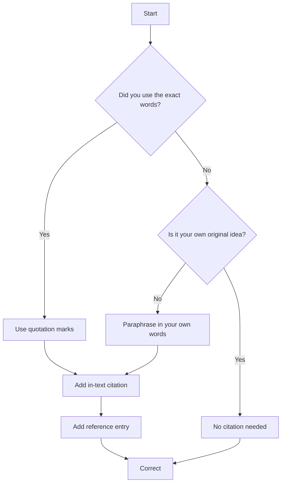

# Plagiarism

!!! info "Learning Objectives"
    By the end of this section, you will be able to:
    - Define plagiarism and identify its various forms.
    - Understand institutional policies regarding academic integrity.
    - Recognize patterns of plagiarism and non-plagiarism.
    - Apply correct citation styles for scientific and technical writing.

## Overview

Academic integrity is a cornerstone of scientific research and education. This section reviews the definition of plagiarism, the policies governing it, and methods to avoid it in academic and professional work.

## Plagiarism Definition

In academic and professional life, it is essential to understand and avoid plagiarism. According to [dictionary.com](https://www.dictionary.com):

> "plagiarism: the practice of taking someone else's work or ideas and passing them off as one's own."

## Plagiarism Policies

Universities and professional organizations maintain strict policies to address plagiarism. The following examples illustrate the standards expected at major institutions.

### Indiana University (IU) Policies

Indiana University [@www-iu-plagiarism] states <https://plagiarism.iu.edu/>:

> "Honesty requires that any ideas or materials taken from another source for either written or oral use must be fully acknowledged. Offering the work of someone else as one's own is plagiarism. The language or ideas thus taken from another may range from isolated formulas, sentences, or paragraphs to entire articles copied from books, periodicals, speeches, or the writings of other students. The offering of materials assembled or collected by others in the form of projects or collections without acknowledgment also is considered plagiarism. Any student who fails to give credit for ideas or materials taken from another source is guilty of plagiarism."
>
> *(Faculty Council, May 2, 1961; University Faculty Council, March 11, 1975; Board of Trustees, July 11, 1975)*

Faculty members are mandated by university policy to report suspected cases of plagiarism. At Indiana University, the policy is as follows:

> "Should the faculty member detect signs of plagiarism or cheating, it is his or her most serious obligation to investigate these thoroughly, to take appropriate action with respect to the grades of students, and *in any event* to report the matter to the Dean for Student Services (or equivalent administrator). The necessity to report every case of cheating... arises particularly because of the possibility that this is not the student's first offense, or that other offenses may follow it. Equity also demands that a uniform reporting practice be enforced..."
>
> *(Faculty Council, May 2, 1961)*

Reporting plagiarism is a professional obligation of the faculty. Consequently, the primary responsibility for ensuring academic integrity lies with the authors of the document. If you are working in a team, you are collectively responsible for ensuring that the entire team adheres to these standards.

### University of Virginia (UVA) Policies

The University of Virginia (UVA) treats plagiarism as academic fraud and an Honor System offense. Policies and detection tools are managed through the UVA Honor Committee, UVA Research Compliance, and institutional libraries.

**Policies and Definitions:**

- **Honor Offense**: Plagiarism is defined as using someone else's language, ideas, or work without giving proper credit.
- **Research Misconduct Policy**: Governed under UVA Policy RES-004, which defines formal institutional procedures for handling data fabrication, falsification, and plagiarism.
- **Core Guidelines**: Detailed in the UVA Honor Committee Plagiarism Supplement, which outlines rules for proper quotation, in-text citation, and referencing.

**Resources and Detection Tools:**

- **iThenticate**: Provided by the Office of the Vice President for Research for faculty, staff, and graduate researchers to verify manuscripts and dissertations before submission.
- **Student Guidance**: The Darden Business Library Plagiarism Guide provides independent tool suggestions and writing tips.
- **Assistance**: Research compliance questions can be directed to the UVA Research Compliance Office.

### Loyola University Chicago (LUC) Policies

Loyola University Chicago (LUC) enforces strict academic integrity guidelines across all undergraduate, graduate, and professional programs. Violations are treated as academic dishonesty and carry disciplinary outcomes.

**Core Institutional Policies:**

- **Definition of Plagiarism**: Plagiarism is defined as using the ideas, language, or work of another person without sufficient public acknowledgment.
- **Lack of Intent**: An absence of intent to deceive does not serve as a valid defense against plagiarism charges. Students are expected to be proficient in proper citation styles before submitting work.
- **AI-Generated Content**: The Office of the Provost restricts the use of AI-assisted software (such as ChatGPT) for any graded deliverables unless explicitly permitted by the instructor.
- **Research Misconduct**: Governed by the LUC Misconduct in Scholarship Policy, which details formal administrative procedures for handling data falsification, fabrication, and plagiarism in advanced research.

**Departmental Sanctions:**

| Academic Unit | Minimum Sanction | Maximum Sanction / Escalation |
| :--- | :--- | :--- |
| College of Arts & Sciences | Grade of zero on the specific assignment. | Course failure, referral to the Academic Dean, or expulsion for repeat offenses. |
| Department of Engineering | Automated zero via detection rules. | Case referral following the strict Department of Philosophy guidelines. |
| Stritch School of Medicine | Professionalism review entry. | Formal hearing board review for unauthorized ghostwriting or AI deployment. |

**Detection Systems and Support:**

- **Turnitin**: Major writing assignments are automatically processed through Turnitin to check for contextual text matches and AI-generated fingerprints.
- **"Did I Plagiarize?" Flowchart**: An interactive tool provided by the LUC Center for Achieving College Excellence (ACE) to help students self-verify originality.
- **Writing Program Resources**: Resources from the Council of Writing Program Administrators are promoted to help students organize citations.
- **Library Research Guides**: The LUC Libraries ACE Guide provides instructional modules on citations and avoiding plagiarism.

If you are ever in doubt about whether a specific passage constitutes plagiarism, you should seek guidance from your instructor before submitting your work. Asking for clarification in advance is a sign of academic diligence and is not considered plagiarism.

## AI Integrity and Ethical Use

The use of Large Language Models (LLMs) requires a clear distinction between assistive tools and academic dishonesty. Using LLMs for brainstorming, structuring outlines, or clarifying complex concepts is generally acceptable as part of the creative process. However, generating final text and presenting it as one's own work constitutes plagiarism unless explicitly permitted by the instructor.

To maintain integrity, AI-generated content must be transparently cited. This includes referencing the specific model version used (e.g., GPT-4o, Claude 3.5 Sonnet) and providing the prompts that led to the generated output. These requirements align with the LUC Office of the Provost restrictions, which prohibit the use of AI-assisted software for graded deliverables without prior authorization.

## Decision Flow

## How to Recognize Plagiarism

The following patterns of plagiarism are defined by the Indiana University plagiarism tutorial (<https://plagiarism.tedfrick.me/plagiarismPatterns/>).

### Comparison Examples

The following examples illustrate the difference between plagiarized and correctly cited text.

**Plagiarized (Crafty Cover-up / Clueless Quote) [^1]:**
The development of artificial intelligence has led to significant breakthroughs in natural language processing, allowing machines to understand and generate human-like text with unprecedented accuracy.

**Corrected:**
"The development of artificial intelligence has led to significant breakthroughs in natural language processing, allowing machines to understand and generate human-like text with unprecedented accuracy" [@label].

[^1]: See [Clueless Quote](https://plagiarism.tedfrick.me/plagiarismPatterns//patternCluelessQuote.html) and [Crafty Cover-up](https://plagiarism.tedfrick.me/plagiarismPatterns//patternCraftyCoverUp.html) for these patterns.

### Plagiarism Patterns [@www-plagiarism-pattern]

| Name | Plagiarism Type | Reason |
| :--- | :--- | :--- |
| [Clueless Quote](https://plagiarism.tedfrick.me/plagiarismPatterns//patternCluelessQuote.html) | Word-for-word | No quotes, no citation, no reference |
| [Crafty Cover-up](https://plagiarism.tedfrick.me/plagiarismPatterns//patternCraftyCoverUp.html) | Word-for-word | Proper paraphrase but word-for-word also present |
| [Cunning Cover-up](https://plagiarism.tedfrick.me/plagiarismPatterns//patternCunningCoverUp.html) | Paraphrasing | No citation, no reference |
| [Deceptive Dupe](https://plagiarism.tedfrick.me/plagiarismPatterns//patternDeceptiveDupe.html) | Word-for-word | No quotes, no citation, but has reference |
| [Delinked Dupe](https://plagiarism.tedfrick.me/plagiarismPatterns//patternDisconnectedDupe.html) | Word-for-word | No reference, even though quotes and citation present |
| [Devious Dupe](https://plagiarism.tedfrick.me/plagiarismPatterns//patternDeviousDupe.html) | Word-for-word | Correct quote but word-for-word also present |
| [Dippy Dupe](https://plagiarism.tedfrick.me/plagiarismPatterns//patternDippyDupe.html) | Word-for-word | Quotes missing, even though full citation and reference present |
| [Disguised Dupe](https://plagiarism.tedfrick.me/plagiarismPatterns//patternDisguisedDupe.html) | Word-for-word | Looks like proper paraphrase, but actually word-for-word; no quotes, no locator |
| [Double Trouble](https://plagiarism.tedfrick.me/plagiarismPatterns//patternDoubleTrouble.html) | Word-for-word & Paraphrasing | Although reference is present |
| [Linkless Loser](https://plagiarism.tedfrick.me/plagiarismPatterns//patternLostLoser.html) | Word-for-word | Citation and reference lacking, although has quotes and locator |
| [Lost Locator](https://plagiarism.tedfrick.me/plagiarismPatterns//patternLostLocator.html) | Word-for-word | Missing locator, although has quotes, citation, and reference |
| [Placeless Paraphrase](https://plagiarism.tedfrick.me/plagiarismPatterns//patternPointlessParaphrase.html) | Paraphrasing | No reference, although citation present |
| [Severed Cite](https://plagiarism.tedfrick.me/plagiarismPatterns//patternSeveredCite.html) | Paraphrasing | Reference present but no citation |
| [Shirking Cite](https://plagiarism.tedfrick.me/plagiarismPatterns//patternShirkingCite.html) | Word-for-word | Lacks locator and reference, although quotes and citation present |
| [Triple D](https://plagiarism.tedfrick.me/plagiarismPatterns//patternTripleD.html) | Word-for-word | Looks like proper paraphrase, but no quotes, no reference, no locator |

### Non-Plagiarism Patterns [@www-plagiarism-pattern]

| Name | Type | Description |
| :--- | :--- | :--- |
| [Correct Quote](https://plagiarism.tedfrick.me/plagiarismPatterns//patternCorrectQuote.html) | Non-plagiarism | Takes another's words verbatim and acknowledges with quotation marks, full in-text citation with locator, and reference |
| [Proper Paraphrase](https://plagiarism.tedfrick.me/plagiarismPatterns//patternProperParaphrase.html) | Non-plagiarism | Summarizes another's words and acknowledges with in-text citation and reference |
| [Parroted Paraphrase](https://plagiarism.tedfrick.me/plagiarismPatterns//patternMindlessParaphrase.html) | Non-plagiarism | Appears to be paraphrasing, and technically may not be plagiarism, though not ideal |

## Citation Styles

Different journals, workshops, and books require different citation styles. While styles like APA and Harvard are common in some fields, they are often not used in scientific and technical writing. Review the rules for the specific publication venue. Using the correct style improves readability and reduces the space occupied by citations.

For example, in APA style:
> "John von Neumann (von Neumann, 1927) describes a Turing machine in his groundbreaking paper..."

In scientific and technical communities, numbered citations are preferred:
> "In [1], a Turing machine is introduced that can..."

Assignments in this course follow numbered ACM or IEEE proceedings and journal citation standards rather than APA style.

## Summary Checklist

- [ ] Defined plagiarism according to academic standards.
- [ ] Reviewed institutional policies (IU, UVA, LUC).
- [ ] Identified common plagiarism patterns (e.g., Clueless Quote, Deceptive Dupe).
- [ ] Distinguished between proper paraphrasing and plagiarism.
- [ ] Identified the preferred citation style for technical writing (ACM/IEEE).

## Assignments

!!! note "Exercise 1"
    Read this document thoroughly to understand the definition of plagiarism and the requirements for proper citation.

!!! note "Exercise 2"
    Compare APA and IEEE citation styles. Explain why numbered citation is generally preferred in scientific and technical writing.

!!! note "Exercise 3"
    Complete and pass the [plagiarism certification](https://www.indiana.edu/~academy/firstPrinciples/certificationTests/index.html). This certification is mandatory for all students in this class.

!!! note "Exercise 4"
    Identify the plagiarism guidelines and policies at Loyola University Chicago.

## Self-Evaluation

??? note "What is the general definition of plagiarism?"
    Plagiarism is the practice of taking someone else's work or ideas and passing them off as one's own.

??? note "Does a lack of intent to deceive excuse a student from plagiarism charges?"
    No. According to institutional policies (such as those at LUC), the absence of intent is not a valid defense; students are expected to be proficient in citation styles.

??? note "What is the difference between a 'Correct Quote' and a 'Dippy Dupe'?"
    A Correct Quote uses quotation marks, an in-text citation with a locator, and a reference. A Dippy Dupe has the citation and reference but misses the quotation marks.

??? note "Which citation style is typically preferred in technical and scientific writing, and why?"
    Numbered citations (e.g., ACM or IEEE) are preferred because they focus on the technology/content rather than the author and save space.

## References

- [Dictionary.com - Plagiarism](https://www.dictionary.com)
- [Indiana University Plagiarism Tutorial](https://plagiarism.tedfrick.me/plagiarismPatterns//patterns.html)
- [IU Plagiarism Policy](https://plagiarism.iu.edu/)
- [LUC Academic Integrity Guidelines](https://www.luc.edu)
- [UVA Honor System](https://www.virginia.edu)
