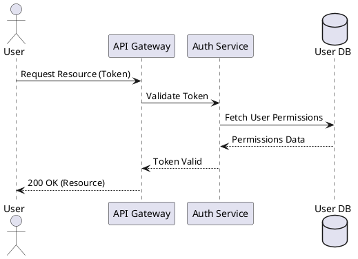
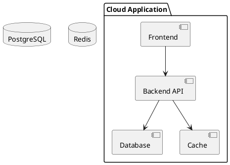
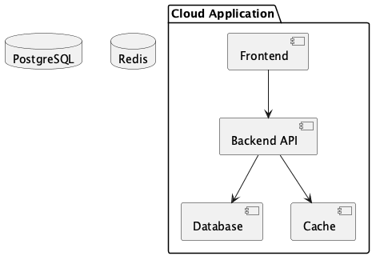
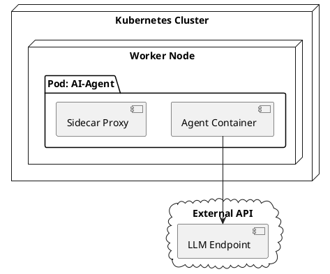
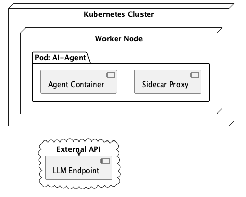
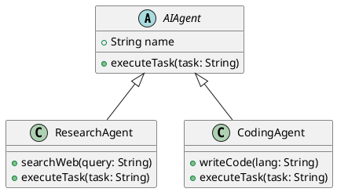
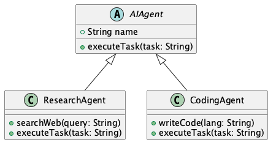

# PlantUML

!!! info "Learning Objectives"
    By the end of this chapter, you will be able to:
    - Understand the benefits of Diagram-as-Code.
    - Create sequence, component, deployment, and class diagrams using PlantUML syntax.
    - Integrate diagrams into technical documentation and version control systems.

## Overview

PlantUML is an open-source tool that allows users to create diagrams from a plain text language. Instead of using a drag-and-drop GUI, diagrams are defined using ASCII specifications, which are then rendered into images.

An extensive set of examples and a comprehensive guide are provided on the official website at [plantuml.com/guide](https://plantuml.com/guide).

For DevOps and AI engineers, this "Diagram-as-Code" approach provides several advantages:

- **Version Control**: Since diagrams are text files, they can be tracked in Git, allowing for diffs and history tracking.
- **Consistency**: Standardized syntax ensures that diagrams maintain a uniform look and feel across different documents.
- **Efficiency**: Modifying a text file is typically faster than rearranging elements in a visual editor.
- **Automation**: Diagrams can be automatically generated or updated as part of a CI/CD pipeline.

## Getting Started

There are two primary ways to use PlantUML:

1. **PlantUML Online Server**: The fastest way to start is by using the official web-based editor at `www.plantuml.com/plantuml`. It renders the ASCII code in real-time.
2. **Local Installation (macOS)**:
    To run PlantUML locally on macOS, you need Java and Graphviz (for rendering most diagram types). The easiest way to install them is via Homebrew:
    
    ```bash
    brew install openjdk graphviz
    ```
    
    To ensure the system can locate the Java runtime, create a symbolic link to the JDK:
    ```bash
    sudo ln -sfn /opt/homebrew/opt/openjdk/libexec/openjdk.jdk /Library/Java/JavaVirtualMachines/openjdk.jdk
    ```
    
    Download the executable JAR file from the [official PlantUML download page](https://plantuml.com/download), rename the downloaded file to `plantuml.jar`, and place it in your project directory. You can then render your diagrams using:
    ```bash
    java -jar plantuml.jar diagram.puml
    ```
    Alternatively, most developers use the **PlantUML extension** in VS Code, which simplifies the process by integrating the renderer directly into the editor.

## Common Diagram Types with Examples

### Sequence Diagrams

Sequence diagrams visualize the interaction between different objects or services over time. They are essential for documenting API flows and authentication handshakes.




### Component Diagrams

Component diagrams describe the high-level structure of a system, showing how different components interact and their dependencies.





### Deployment Diagrams

Deployment diagrams show the physical execution environment of the system, mapping software components to hardware or virtual infrastructure.





### Class Diagrams

Class diagrams are used to model the structure of a system by showing its classes, attributes, operations, and the relationships between objects.





## Summary Table

| Diagram Type | Primary Use Case | Key Keywords |
| :--- | :--- | :--- |
| Sequence | API flows, logic timing | `actor`, `participant`, `->` |
| Component | System architecture, dependencies | `package`, `[Component]`, `-->` |
| Deployment | Infrastructure, K8s mapping | `node`, `cloud`, `package` |
| Class | Object-oriented design, AI hierarchies | `class`, `abstract`, `<|--` |

## Assignments

!!! note "Assignment"
    1. Create a sequence diagram illustrating the process of a user submitting a prompt to an AI agent, the agent calling a tool, and returning the final answer.
    2. Design a component diagram for a RAG (Retrieval Augmented Generation) system including a Vector Database, Embeddings Model, and LLM.
    3. Model a class diagram for a plugin system where a `BasePlugin` class is extended by `GoogleSearchPlugin` and `FileSystemPlugin`.

## References

- [PlantUML Guide](https://plantuml.com/guide)

## Self-Evaluation

??? note "What is the main benefit of using Diagram-as-Code over GUI tools?"
    The main benefits include the ability to use version control (Git) for tracking changes, ensuring visual consistency, and increasing the speed of modifications.

??? note "Which PlantUML diagram is most suitable for documenting a Kubernetes pod structure?"
    The Deployment Diagram is most suitable, as it uses `node` and `package` elements to represent physical or virtual infrastructure.

??? note "In a PlantUML class diagram, what does the `<|--` symbol represent?"
    The `<|--` symbol represents inheritance or generalization, indicating that a subclass extends a base class.
