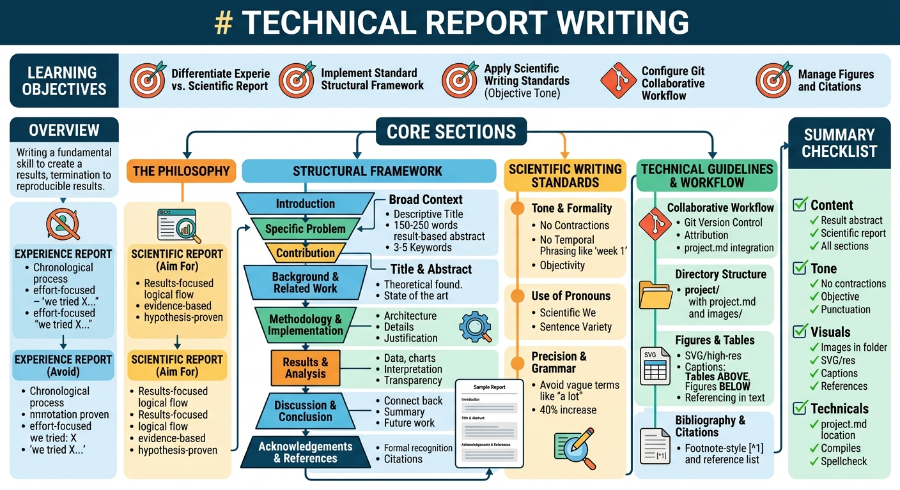

# Technical Report Writing

## Learning Objectives

!!! info "Learning Objectives"
    By the end of this chapter, participants will be able to:
    
    - Differentiate between an experience report and a scientific technical report.
    - Implement a standardized structural framework for technical documents.
    - Apply scientific writing standards to maintain an objective and formal tone.
    - Configure a Git-based collaborative workflow for documentation.
    - Manage technical figures and citations according to scientific standards.

## Overview

Writing a technical report is a fundamental skill in scientific research and engineering. A well-structured report documents work and communicates the value, validity, and reproducibility of results to the broader community. This section provides a framework for producing high-quality, scientific-grade reports.



## Core Sections

### The Philosophy of Technical Reporting

The most common mistake in technical reporting is writing an "experience report" (a diary of what happened) rather than a "scientific report" (a structured argument supported by evidence).

| Feature | Experience Report (Avoid) | Scientific Report (Aim For) |
| :--- | :--- | :--- |
| **Focus** | Process and Timeline | Results and Analysis |
| **Phrasing** | "In week 2, we tried X..." | "To evaluate X, we implemented..." |
| **Narrative** | Chronological order of effort | Logical flow of ideas |
| **Goal** | Proving that work was done | Proving a hypothesis or result |

The target audience is a peer in the field who has the necessary background knowledge but is unfamiliar with the specific project. The goal is to provide enough detail that results can be replicated without external consultation.

### Structural Framework

A technical report follows a standardized structure to ensure clarity and credibility.

#### Title and Abstract

- **Title**: Use descriptive and technical phrasing. Avoid "Project 1" or "Final Report." For example, use "An Analysis of X using Y for Z."
- **Abstract**: A single paragraph (typically 150-250 words) summarizing the entire work.
    - **Correct**: Focus on results. ("We show that X improves efficiency by 20%.")
    - **Incorrect**: Focus on intent. ("We propose to investigate X." This is even tru for writing a proposal for this class. Do not use the word *propose*.)
- **Keywords**: 3-5 terms describing the core technology or method. Avoid generic terms like "In Computer Science."

#### Introduction

The introduction follows an "inverted pyramid" approach:

1. **Broad Context**: The importance of the general area.
2. **Specific Problem**: The exact gap or challenge being addressed.
3. **Contribution**: A brief statement of the work performed to address the gap.
4. **Organization**: A description of the report structure.

#### Background and Related Work

This section provides the theoretical foundation, explaining concepts, algorithms, or existing tools. It demonstrates an understanding of the current state of the field.

#### Methodology and Implementation

This section describes the technical contribution:

- **Architecture**: System design and data flows.
- **Implementation Details**: Specific libraries, versions, and configurations.
- **Justification**: The reasoning behind chosen approaches compared to alternatives.

#### Results and Analysis
Findings must be presented objectively:
- **Data Presentation**: Tables for precise values and charts for trends.
- **Analysis**: Interpretation of data within a real-world context.
- **Transparency**: Inclusion of failed attempts or unexpected results.

#### Discussion and Conclusion
- **Discussion**: Connection of results back to the initial problem statement.
- **Conclusion**: Summary of key findings and suggestions for future work.

#### Acknowledgements and References
- **Acknowledgements**: Formal recognition of contributors or mentors. Use phrasing such as "Provided critical insights into X."
- **References**: A complete list of every source cited in the text.

#### Report Template
The following template provides the basic structural skeleton for a technical report.

```markdown
---
title: "Descriptive and Technical Title"
authors:
  - "Author Name 1"
  - "Author Name 2"
---

# Descriptive and Technical Title

**Authors**: Author Name 1, Author Name 2

## Abstract
[150-250 words focusing on results. Use "We show that..." instead of "We intend to..."]

**Keywords**: keyword1, keyword2, keyword3

## Introduction
[Broad Context -> Specific Problem -> Contribution -> Organization]

## Background and Related Work
[Theoretical foundations and state of the art]

## Methodology and Implementation
[Architecture -> Implementation Details -> Justification]

## Results and Analysis
[Objective data presentation and interpretation]

## Discussion and Conclusion
[Connection to introduction and future work]

## Acknowledgements
[Formal recognition of contributors]

## References
[^1]: Citation 1
[^2]: Citation 2
```

### Scientific Writing Standards

Scientific writing requires precision, objectivity, and a formal tone.

#### Tone and Formality
- **No Contractions**: Use `do not` instead of `don't`, `cannot` instead of `can't`.
- **No Temporal Phrasing**: Avoid phrases such as "Initially," "In the first week," or "After a few days." The logic of the work is the priority, not the timeline.
- **Objectivity**: Avoid emotional language such as "surprisingly," "amazingly," or "unfortunately."

#### Use of Pronouns
- **The Scientific We**: Use "we" (even for single-author papers) to describe actions. Example: "We implemented a custom parser..."
- **Sentence Variety**: Avoid starting every sentence with "We."

#### Precision and Grammar
- **Avoid Vague Terms**: Use "a 40% increase" or "2ms latency" instead of "a lot" or "very fast."
- **Punctuation**: A single space must follow every period, comma, and colon.

### Technical Guidelines for Markdown and GitHub

Using Git for documentation applies the same rigor to writing as is applied to code.

#### Collaborative Workflow
- **Version Control**: Every change is tracked, allowing for recovery of deleted content.
- **Attribution**: Author identification through Git history.
- **Integration**: Storing `project.md` in the same repository as the code ensures synchronization.

#### Directory Structure
To maintain compatibility with automated build scripts, use the following structure:

```text
project/
├── project.md          # The main content
└── images/             # All figures and diagrams
    ├── architecture.svg
    └── results_plot.png
```

#### Figures and Tables
Figures serve as evidence and must be handled with precision.

- **Quality**: Use SVGs for diagrams and high-resolution (300dpi+) PNGs for plots.
- **Captions**:
    - **Tables**: Caption is placed **above** the table.
    - **Figures**: Caption is placed **below** the figure.
- **Referencing**: Every figure must be mentioned in the text using standard format (e.g., "as shown in Figure 1").

### Bibliography and Citations

Proper citation prevents plagiarism and allows for verification of claims.

#### Footnote-Style References
Use footnote-style references for simplicity:
- **In-text**: Use a marker like `[^1]`.
- **Reference List**: Provide the full citation at the end of the document.
    - *Example*: `[^1]: Smith, J. (2023). "Advanced AI Systems," Journal of Computing, 12(4), 45-67.`

## Summary Checklist

### Content and Structure
- [ ] The abstract focuses on results rather than intent.
- [ ] The document is a scientific paper rather than a diary.
- [ ] All sections from Introduction to Conclusion are present.
- [ ] Terms such as "paper," "report," or "chapter" are not used to refer to the document.

### Tone and Style
- [ ] No contractions are used.
- [ ] All references to timelines (e.g., "week 1") are removed.
- [ ] Tone is objective and lacks emotional adjectives.
- [ ] A space follows every period, comma, and colon.

### Visuals and References
- [ ] All images are stored in the `project/images/` folder.
- [ ] All images are SVGs or high-resolution (300dpi+).
- [ ] Every figure has a caption below it and a reference in the text.
- [ ] Every table has a caption above it.
- [ ] External claims are supported by footnote citations.

### Technicals
- [ ] The file is located at `project/project.md` (within the project repository).
- [ ] The document compiles without errors.
- [ ] Spell-checker and grammar-checker have been applied.


## Assignments

!!! note "Assignment.1: Abstract Refactoring"
    Take an existing "intent-based" abstract (e.g., "In this project, we intend to study the effect of X on Y") and rewrite it as a "result-based" scientific abstract.

    ??? tip "Solution: Abstract Refactoring"
        A result-based abstract focuses on the outcome: "We demonstrate that X increases Y by 15%, suggesting that..."

!!! note "Assignment.2: Tone Correction"
    Rewrite the following sentence to meet scientific standards: "In the first week, we surprisingly found that the code was way too slow, so we tried to fix it."

    ??? tip "Solution: Tone Correction"
        "Initial testing revealed that the implementation did not meet performance requirements; consequently, the algorithm was optimized."

!!! note "Assignment.3: Figure Referencing"
    Correct the following text: "The results are shown in the figure below. It is quite a big jump in speed."

    ??? tip "Solution: Figure Referencing"
        "The results are shown in Figure 1. The data indicates a significant increase in execution speed."

## References

- IEEE Editorial Style Manual: [ieee.org/publications/ieee-style-manual](https://ieee.org/publications/ieee-style-manual)
- Purdue OWL Technical Writing: [owl.purdue.edu](https://owl.purdue.edu)

## Self-Evaluation

??? note "What is the difference between an experience report and a scientific report?"
    An experience report focuses on the chronological process and effort (the "diary" approach), whereas a scientific report focuses on results, analysis, and a logical argument supported by evidence.

??? note "Where should captions be placed for tables versus figures?"
    Table captions must be placed above the table, and figure captions must be placed below the figure.

??? note "Why is temporal phrasing like 'In week 1' prohibited in technical reports?"
    Technical reports focus on the logical progression of research and the validity of results. The time taken to achieve a result is generally irrelevant to the scientific value of the work.
